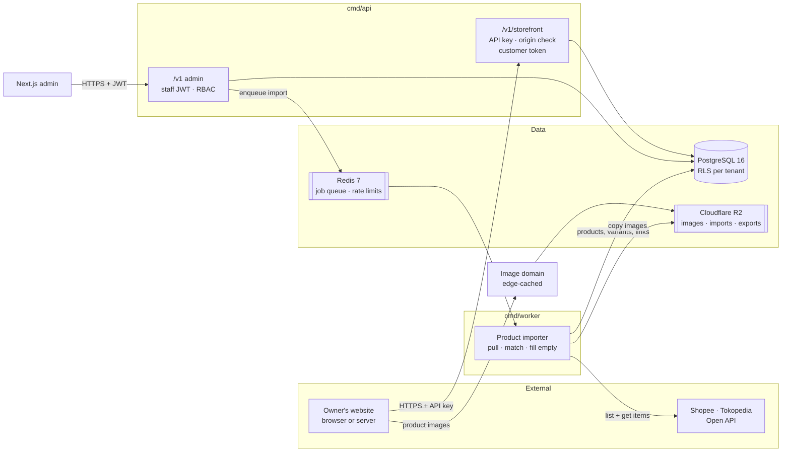

# Ecommerce Backoffice v2 · Product Requirements

**Version** 2.0 · **Date** 6 October 2026 · **Owner** Iqbal Hamdani, Koltiva
**Stack** Go 1.23 · PostgreSQL 16 · Next.js 15 (App Router) · Cloudflare R2
**Tenancy** Shared schema, `tenant_id` column, PostgreSQL Row-Level Security

What the product is, who uses it, what they do with it, and how we know each part is done. Rules
are cited as `BR-xxx` and live in `02-business-rules.md`. The schema is `03-erd.md`, the HTTP
contract is `04-api-spec.md`, and build order and status are `05-backlog.md`.

---

## 1. What this is

A **backoffice** where a shop owner manages products and orders, and an open **storefront API**
that the owner's own custom website reads from: products, categories, brands, cart, checkout,
customer accounts and order history. Products can be imported from Shopee and Tokopedia.

The load-bearing parts are the storefront API's security model and checkout. A bug in either is a
customer-data leak or a wrong order on someone's live website. Most of the rest is ordinary CRUD
done carefully.

### 1.1 What changed from v1

v1 (the v1.0 spec and the Phase 1 contracts up to v1.6.1) was a catalog-first product master
heading towards stock, fulfilment and marketplace sync. v2 rescopes it around how the product will
actually be used.

| Area | v1 | v2 |
|---|---|---|
| Stock | Ledger, balances, locations, reservations | Not tracked. Visible means orderable (BR-017) |
| Marketplaces | Catalog CSV export, then order import and stock/price push | Product and variant import only, pulled on demand (§6.4) |
| Fulfilment | Fulfilments, pick and pack, shipments | Courier and tracking number recorded on the order (BR-072) |
| Returns | RMA with grading and restock | Removed |
| Idempotency | `Idempotency-Key` header | One cart becomes one order (BR-088) |
| Outbound webhooks | Tenant subscriptions | Removed |
| Storefront | Not in scope | Open API for the owner's website (§6.3) |
| Roles | Five, including `warehouse` | Four (BR-023) |
| Scale | 10–12k orders/day, flash sales | 2–5 orders/day per tenant, no flash sales |

Work already done in v1 (foundation: tenancy, RLS, auth, RBAC, errors, app shell) carries over
unchanged except where `05-backlog.md` lists a follow-up.

---

## 2. Scope

### 2.1 In scope — five modules

| # | Module | What it covers |
|---|---|---|
| M1 | Order management | Orders placed through the storefront or entered manually, a short status flow, courier and tracking number, customer views, CSV export. |
| M2 | Products / PIM / variants | Products, the variant matrix, brands, categories, bulk edit, CSV import, images. |
| M3 | Storefront API | The owner's website's only data source: catalog, cart, checkout, customer accounts, order history. |
| M4 | Marketplace product import | Pull products and variants from Shopee and Tokopedia into M2. |
| M5 | Tenancy, users, roles | Shared-schema multi-tenancy with RLS, staff accounts, roles, API keys, audit log. |

**App language: English** (BR-016), and so are these documents.

### 2.2 Deliberately out of scope

Stock tracking of any kind (locations, ledger, reservations, sold-out states) · marketplace order
import · stock or price push to marketplaces · fulfilment workflow (pick, pack, partial shipments)
· courier booking, rate quotes and labels · returns and RMA · outbound webhooks · WMS, purchasing,
batch and expiry, POS · promotions engine · accounting integration beyond a CSV export.

**No stock is a deliberate choice, not an omission** (BR-017). A variant can be ordered whenever
its product is `active` and the variant is not archived. When an owner no longer has an item, they
archive the variant, or contact the customer after the order arrives.

Tell pilot owners this before onboarding. They will ask in week one; have the answers ready:

| Request | Answer |
|---|---|
| "Where do I set stock?" | There is none. Archive a variant you no longer have. |
| "Can it sync my Shopee orders?" | No. Orders come from your website or are entered by hand. Products can be imported from Shopee and Tokopedia. |
| "Will a price change on Shopee update here?" | No. After the first import the backoffice owns your data (BR-104). |
| "Can it book the courier?" | No. Book it as you do today and enter the tracking number. |
| "Can customers pay online?" | Not yet: bank transfer, confirmed by you (BR-074). See §9. |

### 2.3 Hard requirements that shape the design

1. **The storefront API is the owner's website.** If it is slow or down, their shop is. Its
   latency and availability targets are the ones that matter (§8).
2. **Customer data is never reachable with a key that ships in browser code.** A publishable key
   reads public data and manages carts; anything personal needs a customer or order token
   (BR-082).
3. **Prices are computed on the server, always.** The website sends variant ids and quantities.
   Totals come from `variants.price_amount` at the moment of checkout (BR-089).
4. **One cart, one order.** A double-tapped "Place order" on a slow phone must never create two
   orders (BR-088).
5. **Variant matrices, not variant records.** Hundreds of styles × five sizes is thousands of rows;
   the API supports grid-shaped bulk edit (BR-041). (Erigo.)
6. **Re-importing a marketplace shop never duplicates and never overwrites the owner's edits**
   (BR-103, BR-104).

---

## 3. Users

| Who | Where | What they do |
|---|---|---|
| **Owner** | Admin | Sets up the shop, issues API keys, connects marketplaces, invites the team. Role `owner` |
| **Admin** | Admin | Runs the catalog: products, matrix, categories, imports. Role `admin` |
| **Ops** | Admin | Works orders every day: confirms payments, ships, enters WhatsApp orders. Role `ops` |
| **Bookkeeper** | Admin | Reads orders and exports them. Role `viewer` |
| **Website developer** | Storefront API docs | Builds the owner's website from the public storefront docs and a key |
| **Shopper** | The owner's website | Browses, checks out as a guest or with an account, tracks orders |

Roles and their permissions: BR-023 and `04-api-spec.md` §3. A screen a user may not use does not
appear (BR-025).

---

## 4. Screens

| Screen | Main user | Purpose | Module |
|---|---|---|---|
| Sign in / accept invitation | All staff | Way in | M5 |
| Onboarding wizard | Owner | Shop settings, first brand, first category tree, first API key | M5 |
| Order list | Ops | Daily workspace. Saved views, search | M1 |
| Order detail | Ops | Status actions, ship dialog, refund record, audit trail | M1 |
| Manual order entry | Ops | WhatsApp orders, priced from the catalog | M1 |
| Customer list and detail | Ops | Profile and order history | M1 |
| Product list | Admin | Search, filter, multi-select bulk actions | M2 |
| Product editor | Admin | Title, slug, description, brand, attributes, categories, media | M2 |
| **Variant matrix editor** | Admin | The differentiating screen. Options × values grid | M2 |
| Category manager | Admin | One tree per `kind`; drag to move, rename | M2 |
| Brand manager | Admin | Brands | M2 |
| Bulk import wizard | Admin | Upload CSV, map columns, watch progress, download errors | M2 |
| Media library | Admin | Images per product: reorder, attach to variants | M2 |
| API keys | Owner/Admin | Create (shown once), name, allowed origins, revoke; link to storefront docs | M3 |
| Channels | Owner/Admin | Connect, import, result, linked listings | M4 |
| Team & roles | Owner/Admin | Invite, assign roles, disable | M5 |
| Settings | Owner | Shop name, time zone, order prefix | M5 |
| Audit log | Owner/Admin | Who changed what | M5 |

---

## 5. Architecture in one page

**Modular monolith, three binaries.** One Go module, one image, three entrypoints: `cmd/api` (two
route trees, `/v1` admin and `/v1/storefront`, stateless), `cmd/worker` (imports, image
derivatives, exports) and `cmd/migrate`. Not microservices: at this scale service boundaries cost
far more than they buy.

Three things to notice, because they are the design:

1. **Two route trees, one binary, one database.** Separate middleware chains, but every query runs
   through `InTenantTx`, so RLS protects storefront reads exactly as it protects admin ones. A
   storefront request's tenant comes from its API key, never from the request (BR-003).
2. **Marketplace traffic is outbound only.** No public webhook endpoint, nothing that can be lost
   while the API is down. A failed import is simply run again (BR-100).
3. **Images are public; nothing else is.** Product images are served from an edge-cached image
   domain, so the owner's website renders them without a key (BR-053).

| Concern | Choice | Why |
|---|---|---|
| HTTP router | `chi` | Stdlib `http.Handler`; two middleware chains compose cleanly |
| DB access | `pgx/v5` + `sqlc` | Real SQL. RLS, `FOR UPDATE` and `security_invoker` views need SQL you control |
| Migrations | `golang-migrate` | Plain up/down SQL, reviewable |
| Queue | Redis Streams + consumer groups | At-least-once with ack. Redis is already needed for rate limits and token revocation |
| Object storage | Cloudflare R2 | Zero egress makes public product images on owners' websites cheap |
| Frontend | Next.js 15 App Router | The admin only. The storefront is the owner's own website |
| Observability | OpenTelemetry | Trace checkout and each import job end to end |

**Deployment: one VPS** (start at 4 vCPU / 8 GB / NVMe, Docker Compose): Caddy, Next.js,
`cmd/api` ×2 (so a deploy drains one at a time and never drops a checkout), `cmd/worker` ×1,
PostgreSQL 16, Redis 7 (AOF `everysec`). Cloudflare in front (DNS, WAF, edge rate limits); a
Cloudflare Worker in front of R2 for the image domain. Running on one box makes these our job:
**backups** (pgBackRest or wal-g to R2, restore-tested before the first pilot), per-service
`cpus`/`mem_limit`, PostgreSQL tuned for a shared box, alert at 70% disk. Move PostgreSQL to a
managed instance first when outgrowing the box, then split the worker. Neither needs a code change.

---

## 6. Modules: stories and acceptance

Acceptance criteria are written to be testable. Anything not testable does not belong here.

### 6.1 M1 — Order management

The order list is where ops work, at a few orders a day rather than thousands: server-rendered,
50 rows a page. Columns: order number, source badge, customer, item count, total, status pill,
placed-at (relative). Saved views: **To confirm payment** (pending), **To ship** (paid,
processing), **Shipped**, **Cancelled, refund owed** (BR-075).

**Stories.**
- As ops I confirm a bank transfer and mark the order paid from the list.
- As ops I enter a WhatsApp order with the customer's address, priced from the catalog.
- As ops I enter the courier and tracking number when I ship, and the customer sees them in their
  order history.
- As ops I see every cancelled order that was paid but not yet refunded, and record the refund.
- As a bookkeeper I export last month's completed orders to CSV.

**Acceptance.**
- Two concurrent checkouts of the same cart produce exactly one order, and both requests receive
  it (BR-088).
- An order's totals equal the sum of catalog prices at checkout; a request containing any price
  field is `422` (BR-089).
- Moving an order to `shipped` without courier and tracking number is `422`, and the database
  refuses it even if the handler check is bypassed (BR-072).
- Every status change writes exactly one `audit_log` row with actor, from and to (BR-073).
- A transition not in the allow-list returns `409 illegal_transition` and changes nothing (BR-070).
- Order list first byte under 800 ms at p95 with 10,000 orders in the tenant.

### 6.2 M2 — Products and PIM

**The variant matrix editor is the differentiating screen.** Options across the top, values down
the side, a spreadsheet grid of SKU, price and weight. Paste from Excel. Fill-down. Bulk price
adjustment by percentage or amount across a selection, with a preview before it applies.

**Stories.**
- As an admin I create a tee with Colour × Size and fill 30 SKUs and prices in one grid.
- As an admin I paste 200 price changes from a spreadsheet into the product list grid.
- As an admin I upload my existing 10,000-row product spreadsheet, map its Indonesian column
  headers, and download the rows that failed.
- As an admin I move "Jackets" under "Outerwear" and its products stay assigned.

**Acceptance.**
- A product with 2 options × 6 and × 5 values renders 30 variant cells and saves in one request
  (BR-041).
- A duplicate SKU is rejected per row with the other rows still applied (BR-039, BR-041).
- CSV import of 10,000 variants completes within 5 minutes and produces a downloadable per-row
  error report citing original line numbers (BR-044).
- A product cannot be set `active` while any of its variants lacks a SKU (BR-038).
- Draft and archived products never appear in any storefront response (BR-080).
- Archiving a product does not change its order-line history (BR-045).
- A product may belong to several categories of different `kind` at once (BR-031).
- Renaming a category rewrites every descendant path in one statement (BR-032).

### 6.3 M3 — Storefront API

Admin screens: API keys (create, name, allowed origins, revoke; the key is shown once) and a link
to the public storefront docs.

**Stories.**
- As an owner I create a publishable key for `https://tokoabc.com` and give it to my website
  developer.
- As a website developer I build product, cart, checkout and order-history pages from the public
  docs alone.
- As a shopper I add items to a cart, check out as a guest, and later open my order with the link I
  was given.
- As a shopper I create an account and see all my past orders on the shop's website.

**Acceptance.**
- With customer A's token, no storefront route returns any of customer B's data. Asserted by an
  automated suite over every customer-scoped route (BR-082).
- A customer token issued for tenant A, sent with tenant B's API key, returns `401` (BR-086).
- No route under `/v1/storefront/me` or `/v1/storefront/orders` answers with an API key alone
  (BR-082).
- A publishable key from an origin not on its allowlist returns `403` with no
  `Access-Control-Allow-Origin` header (BR-083).
- A secret key on a request carrying `Sec-Fetch-Site` returns `403 secret_key_in_browser`
  (BR-084).
- A revoked key stops working within 60 seconds (BR-085).
- An order token for one order never opens another (BR-091).
- Reusing an already-rotated refresh token revokes that customer session (BR-093).
- Storefront responses contain no field outside the storefront views (BR-081).

### 6.4 M4 — Marketplace product import

Screens: channel list with status · connect wizard · import dialog (new products as draft or
active) · import result with downloadable error report · linked listings view.

**Stories.**
- As an owner I connect my Shopee shop and import its 1,000 products as drafts, then review and
  publish them.
- As an owner who sells the same tee on Shopee and Tokopedia, I import both and get one product.
- As an admin I re-import after adding new items on Shopee, and my edited prices stay as I set
  them.

**Acceptance.**
- Importing the same shop twice creates zero new products or variants the second time (BR-103).
- A product listed on Shopee and Tokopedia with matching seller SKUs ends up as one product, with
  one listing link per channel per variant (BR-103).
- A description, price, weight or SKU edited in the backoffice is unchanged after a re-import
  (BR-104).
- An item that fails to import appears in the error report; every other item still imports
  (BR-107).
- No imported product image URL points at a marketplace domain (BR-106).
- A failed token refresh moves the channel to `reauth_required` and shows Reconnect; the job does
  not retry silently (BR-102).
- Two import clicks on one channel run one import (BR-100).

### 6.5 M5 — Tenancy, users, roles

**Acceptance.**
- With tenant A's token or key, no endpoint returns any tenant B row. Asserted by an automated
  suite over every registered route, admin and storefront (BR-001, BR-003).
- A storefront customer token is rejected on every admin route (BR-086).
- Disabling a user invalidates their refresh token within 15 minutes at worst, immediately if the
  revocation list is hit (BR-027).
- Every permission-denied response is `403` with the required permission named in `detail`
  (BR-024).
- Every admin mutation writes one `audit_log` row (BR-018).

---

## 7. Journeys worth walking end to end

### 7.1 A guest buys on the owner's website

1. The website, holding a publishable key, lists products and opens `erigo-basic-tee`.
2. "Add to cart" creates a cart (the website stores `cart_id` in its own cookie) and sets the
   variant's quantity.
3. Checkout sends contact and address, no prices. The order comes back `pending` with an
   `order_token`; the website shows bank transfer instructions and a "track my order" link.
4. Ops sees it under **To confirm payment**, checks the transfer, marks it paid; later ships it
   with JNE and a tracking number.
5. The shopper opens the tracking link and sees `shipped`, the courier and the tracking number.

### 7.2 First marketplace import

1. The owner connects Shopee; the channel shows `connected`.
2. Import as drafts. The job page shows progress, then "980 created, 12 linked by SKU, 8 failed".
3. The owner downloads the 8 failures, fixes them on Shopee, and imports again: zero new
   products, 8 more created, nothing they edited overwritten.

---

## 8. Non-functional requirements

### 8.1 Performance targets

The design point is storefront browsing, not order volume.

| Path | Target | Why |
|---|---|---|
| Storefront product list and detail | p95 < 300 ms | Every page view on the owner's website waits on it |
| Storefront checkout | p95 < 1 s | Where a shopper is most likely to give up |
| Admin order list first byte | p95 < 800 ms at 10k orders | The screen ops use every day |
| Variant matrix save, 100 cells | < 2 s | Feels synchronous |
| CSV import, 10,000 variants | < 5 min | One operator action |
| Marketplace import, 1,000 items | < 20 min | Bounded by the marketplace's rate limit; revisit once the partner quota is known |

### 8.2 Scale assumptions per tenant, year one

Up to 10k variants · 2–5 orders a day (about 2,000 a year), no flash sales · 1–2 connected
marketplace shops · 5 staff users · 5 GB R2. Storefront reads dominate load and are cacheable. A
single well-indexed PostgreSQL primary handles many tenants this size; do not shard and do not
pre-optimise.

### 8.3 Availability and recovery

- **99.5% monthly** on a single VPS, about 3.6 hours a year. 99.9% is not honestly claimable
  without redundant hosts; keep it out of customer contracts until PostgreSQL is off-box.
- The storefront API is where downtime costs money, so it runs as two replicas and nothing in its
  request path depends on the worker, the marketplaces or R2 (images aside).
- **RPO 5 minutes** via PostgreSQL PITR. **RTO 1 hour.**
- Degraded modes, designed rather than emergent: **Redis down** → admin and storefront keep
  working, rate limits fall back to per-process, imports and image processing pause.
  **Marketplace down** → that import fails and can be re-run. **R2 down** → images fail to load;
  catalog, carts and orders are unaffected.

### 8.4 Security

- TLS 1.3 only, HSTS, Cloudflare WAF in front of everything.
- Channel credentials envelope-encrypted, decrypted only in the worker, never logged (BR-101). The
  guest order-token key lives in the same KMS (BR-091).
- Passwords `argon2id`, 64 MB, 3 iterations, staff and customers alike (BR-022, BR-092).
- API keys stored as SHA-256 hashes, plaintext shown once (BR-028).
- Staff and customer tokens are separate audiences; neither works on the other's routes (BR-086).
- Storefront handlers read only the storefront views (BR-081).
- Every admin mutation is audited with actor, IP and before/after (BR-018).
- PII lives in `customers`, `orders.customer` and `orders.shipping_address`, and can be purged
  without touching the catalog (BR-097).
- Logs redact by default; keys, tokens and credentials are never logged (BR-013).

### 8.5 Observability

Trace storefront request → checkout → order insert as one trace, and each import job as one trace
with a span per batch. Alert on: storefront 5xx rate > 1% · checkout p95 > 2 s · a spike in
`origin_not_allowed` (usually an allowlist not updated after a domain change) · any
`secret_key_in_browser` · a spike in failed customer logins per tenant (credential stuffing) · any
channel in `reauth_required` for more than 24 hours · any failed import job.

### 8.6 Testing

| Layer | Approach |
|---|---|
| Unit | Domain logic pure where possible: state machine, checkout pricing, import matching, fill-only merge |
| Integration | Real PostgreSQL. No mocked database: RLS, row locks and `security_invoker` views cannot be mocked meaningfully |
| Isolation | Generated suites over every route: two tenants, two customers per tenant, zero leakage both ways |
| Concurrency | `go test -race`, plus 20 parallel checkouts of one cart: exactly one order, all 20 responses carry it |
| Storefront auth | Table-driven over key kind × origin × fetch-metadata × token presence, against every storefront route |
| Channel adapters | Recorded HTTP fixtures per marketplace, replayed; sandbox contract tests where offered |
| Load | k6 against staging on the production VPS spec: storefront browsing at 10× expected peak with an import running |
| Migration | Every migration applied to a restored production-shaped snapshot in CI |

---

## 9. Open questions

| Question | Decide before | Why it matters |
|---|---|---|
| **Payment.** Manual bank transfer is assumed. A gateway (Midtrans, Xendit) would call the same Transition (BR-074). | Phase 3 | Checkout could return a payment link from day one |
| **Shipping cost at checkout.** Stored, but no source yet: free, flat per shop, or live rates (Biteship). | Phase 3 | Decides whether checkout shows a total before it has the address |
| **Transactional email provider.** Password reset needs it; order confirmations probably should. | Phase 3 | Blocks `P1-207` |
| **Customer sign-in method.** Email and password specified; WhatsApp OTP may convert better but needs a paid provider. | Phase 3 | Changes `P1-206` |
| **Shopee partner approval.** Lead time outside our control. | Apply in Phase 0 | Blocks Phase 4 |
| **Tokopedia API access.** Since the 2024 merger its seller API is moving under TikTok Shop's Partner Center. | Before scheduling Phase 5 | If not available by week 20, ship without it and keep the adapter slot open |
| **Multi-currency.** IDR-only with the scale kept uniform. Confirm no cross-border sellers in the pilot cohort. | Pilot | BR-029 |
| **Production domain.** Every document still says `{domain}`. | `P1-001` | TLS mode behind Cloudflare is part of that item |

---

## 10. Decisions to record as ADRs

Written in `new-commerce-api/docs/adr/` before Phase 0 ends; each will be questioned in month six.

Shared-schema tenancy with RLS, not schema-per-tenant · modular monolith, not microservices · no
stock tracking: visible means orderable · admin and storefront as two route trees in one binary ·
publishable and secret keys with an origin allowlist; personal data only behind customer or order
tokens · storefront reads through `security_invoker` views · checkout idempotency from the cart,
not an `Idempotency-Key` header · stateless HMAC guest order tokens · pull-only marketplace
import; the backoffice owns product data after the first import · Redis Streams for jobs, not
PostgreSQL-as-queue · Cloudflare R2 with a public, edge-cached image domain · `sqlc` over an ORM ·
cursor-only pagination.
