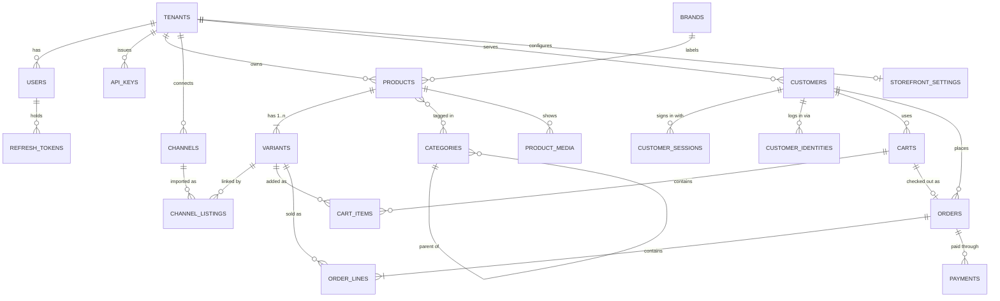

# Ecommerce Backoffice v2 · Data Model

**24 tables, 2 views.** Constraints are tagged with the rule they enforce (`BR-xxx`, see
`02-business-rules.md`). The API contract is `04-api-spec.md`; which backlog item builds which
table is `05-backlog.md`. Migrations in `new-commerce-api/db/migrations/` must match this file;
if they disagree, the migration is the bug.

---

## 1. Entity relationships



`product_categories` is the join table behind the many-to-many, and it is what lets one product sit
in several trees of different `kind` at once (BR-031). Not drawn: `jobs`, `order_sequences` and
`audit_log`, which hang off `tenants` alone.

| Area | Tables | Module |
|---|---|---|
| Platform | `tenants`, `users`, `refresh_tokens`, `api_keys`, `audit_log`, `jobs` | M5 |
| Catalog | `brands`, `categories`, `products`, `variants`, `product_categories`, `product_media` | M2 |
| Marketplace import | `channels`, `channel_listings` | M4 |
| Storefront | `storefront_settings`, `customers`, `customer_identities`, `customer_sessions`, `carts`, `cart_items` | M3 |
| Orders | `orders`, `order_lines`, `order_sequences`, `payments` | M1 |
| Views | `storefront_products`, `storefront_variants` | M3 |

---

## 2. Conventions

These hold for every table.

- **Keys** are `uuid` v7, generated app-side. `carts.id` is the one v4 (BR-005).
- **Money** is `bigint` minor units plus a `char(3)` currency. `2000000` + `IDR` is Rp 20,000
  (BR-006).
- **Quantities** are `integer` and appear only on cart items and order lines. There is no quantity
  on `variants`, ever (BR-017).
- **Timestamps** are `timestamptz`, never `timestamp`; every session runs with `TimeZone = 'Asia/Jakarta'` (WIB) (BR-007).
- **Archive, don't delete** via `archived_at timestamptz` on brands, categories, products and
  variants (BR-012). Orders are never deleted, only cancelled (BR-079).
- **Optimistic concurrency** via `version integer NOT NULL DEFAULT 1` on products, variants and
  orders, checked in `UPDATE … WHERE version = $n` and exposed as
  `If-Match` (BR-010).
- **Every tenant table** gets `ENABLE` + `FORCE ROW LEVEL SECURITY` and the `tenant_isolation`
  policy (BR-001). It is written once below; assume it on every table with `tenant_id`.
- **A copied `tenant_id` on a child table** is held by a composite foreign key to the parent's
  `(id, tenant_id)` (BR-004).
- **Composite indexes lead with `tenant_id`.** RLS adds that predicate to every query; an index
  that cannot serve it is dead weight.

### 2.1 Why `tenant_id` is repeated on child tables

`variants.tenant_id` is derivable from `products.tenant_id`, so it is denormalised on purpose, and
the reason is RLS. Without the column the policy has to be a correlated subquery:

```sql
-- What you are forced into WITHOUT the column
CREATE POLICY tenant_isolation ON variants USING (
    EXISTS (SELECT 1 FROM products p
            WHERE p.id = variants.product_id
              AND p.tenant_id = current_setting('app.tenant_id')::uuid));
```

That predicate attaches to **every** query touching `variants`, including the catalog joins behind
every storefront page, the hottest path in the system. No index on `variants` alone can serve it,
and `UNIQUE (tenant_id, sku)` cannot be expressed at all. With the column the policy is a plain
indexable equality, and the composite foreign key makes the two copies impossible to disagree.

---

## 3. DDL

Abbreviated to the load-bearing columns and constraints; every column that matters to the API is
here.

### 3.1 Extensions, roles and the RLS helper

```sql
CREATE EXTENSION IF NOT EXISTS ltree;      -- categories.path
CREATE EXTENSION IF NOT EXISTS unaccent;   -- slugify
CREATE EXTENSION IF NOT EXISTS pg_trgm;    -- product title search
CREATE EXTENSION IF NOT EXISTS citext;     -- users.email

-- BR-001. The app connects as a role that owns nothing, so RLS always applies.
CREATE ROLE app_user LOGIN PASSWORD :'pw';
GRANT SELECT, INSERT, UPDATE, DELETE ON ALL TABLES IN SCHEMA public TO app_user;

-- BR-001. On every tenant-owned table. Written once; assume it everywhere.
-- ALTER TABLE <t> ENABLE ROW LEVEL SECURITY;
-- ALTER TABLE <t> FORCE ROW LEVEL SECURITY;   -- applies to the owner too
-- CREATE POLICY tenant_isolation ON <t>
--     USING      (tenant_id = current_setting('app.tenant_id', true)::uuid)
--     WITH CHECK (tenant_id = current_setting('app.tenant_id', true)::uuid);
--
-- P1-006 wraps the three statements in enable_tenant_rls(regclass), so a table's
-- migration is one line and cannot get three of the four right.
```

### 3.2 Platform (M5)

```sql
CREATE TABLE tenants (
    id           uuid PRIMARY KEY,
    name         text NOT NULL,
    slug         text NOT NULL UNIQUE,
    -- BR-077. Prefix of the human order number: 'TKA' -> TKA-000123.
    order_prefix text NOT NULL CHECK (order_prefix ~ '^[A-Z0-9]{2,6}$'),
    timezone     text NOT NULL DEFAULT 'Asia/Jakarta',       -- BR-029
    status       text NOT NULL DEFAULT 'active'
                 CHECK (status IN ('active','suspended','closed')),
    created_at   timestamptz NOT NULL DEFAULT now()
);
-- tenants has no RLS; it is reached only through the auth paths (BR-003).

CREATE TABLE users (
    id            uuid PRIMARY KEY,
    tenant_id     uuid NOT NULL REFERENCES tenants(id),
    email         citext NOT NULL,
    password_hash text,                 -- NULL while invited; the invite token is signed
                                        -- and expiring, never stored (BR-026)
    name          text NOT NULL,
    role          text NOT NULL DEFAULT 'viewer'
                  CHECK (role IN ('owner','admin','ops','viewer')),     -- BR-023
    status        text NOT NULL DEFAULT 'invited'
                  CHECK (status IN ('invited','active','disabled')),
    last_login_at timestamptz,
    created_at    timestamptz NOT NULL DEFAULT now(),
    UNIQUE (email)                      -- BR-020: system-wide, not per tenant
);

CREATE TABLE refresh_tokens (
    id           uuid PRIMARY KEY,
    tenant_id    uuid NOT NULL REFERENCES tenants(id),
    user_id      uuid NOT NULL REFERENCES users(id) ON DELETE CASCADE,
    token_hash   text NOT NULL UNIQUE,  -- SHA-256; the plaintext lives only in the cookie
    -- BR-022. Rotation chain: a reused (already rotated) token means theft.
    -- Revoke the whole chain, not just that one request.
    rotated_from uuid REFERENCES refresh_tokens(id),
    expires_at   timestamptz NOT NULL,
    revoked_at   timestamptz,
    created_at   timestamptz NOT NULL DEFAULT now()
);
CREATE INDEX ON refresh_tokens (user_id) WHERE revoked_at IS NULL;

CREATE TABLE api_keys (
    id              uuid PRIMARY KEY,
    tenant_id       uuid NOT NULL REFERENCES tenants(id),
    name            text NOT NULL,          -- 'Main website', 'Staging site'
    -- BR-028. One kind of key: works from the website in a browser (origin-checked,
    -- BR-083) and from the website's own server. Personal data needs a customer
    -- or order token on top (BR-082).
    key_hash        text NOT NULL UNIQUE,   -- SHA-256; the plaintext is shown once
    -- The website's URL: exact scheme + host + port, no path, e.g. 'https://tokoabc.com'.
    -- One per key; a second origin (www, staging) gets its own key (BR-028).
    allowed_origin  text NOT NULL CHECK (allowed_origin ~ '^https?://[^/?#]+$'),
    last_used_at    timestamptz,
    revoked_at      timestamptz,
    created_by      uuid REFERENCES users(id),
    created_at      timestamptz NOT NULL DEFAULT now()
);

-- BR-003. The one pre-tenant query on the storefront path. Returns only what the
-- middleware needs; never a general-purpose RLS bypass.
CREATE FUNCTION resolve_api_key(p_hash text)
RETURNS TABLE (id uuid, tenant_id uuid, allowed_origin text, revoked_at timestamptz)
LANGUAGE sql STABLE SECURITY DEFINER SET search_path = public AS $$
  SELECT id, tenant_id, allowed_origin, revoked_at FROM api_keys WHERE key_hash = p_hash;
$$;

CREATE TABLE audit_log (                -- BR-018, BR-073
    id           bigserial PRIMARY KEY, -- internal only, never in an API (BR-005)
    tenant_id    uuid NOT NULL,
    actor_id     uuid,                  -- NULL for the system (import worker, retention job)
    action       text NOT NULL,         -- 'order.transition', 'api_key.create', 'channel.import'
    subject_type text NOT NULL,
    subject_id   text NOT NULL,
    before       jsonb,
    after        jsonb,
    ip           inet,
    created_at   timestamptz NOT NULL DEFAULT now()
);
CREATE INDEX ON audit_log (tenant_id, subject_type, subject_id, created_at DESC);

-- BR-060. Redis Streams delivers jobs; this row is what GET /v1/jobs/{id} reads,
-- so job state survives a Redis restart.
CREATE TABLE jobs (
    id           uuid PRIMARY KEY,
    tenant_id    uuid NOT NULL REFERENCES tenants(id),
    kind         text NOT NULL CHECK (kind IN ('product_import','order_export',
                                               'channel_import','image_derivatives')),
    state        text NOT NULL DEFAULT 'queued'
                 CHECK (state IN ('queued','running','done','failed')),
    processed    integer NOT NULL DEFAULT 0,
    total        integer,
    failed       integer NOT NULL DEFAULT 0,
    params       jsonb NOT NULL DEFAULT '{}'::jsonb,   -- r2_key, column_mapping, filters, …
    result       jsonb,                                -- counts, result_key, error_report_key
    error        jsonb,                                -- a Problem when state = 'failed'
    created_by   uuid REFERENCES users(id),
    created_at   timestamptz NOT NULL DEFAULT now(),
    finished_at  timestamptz
);
CREATE INDEX ON jobs (tenant_id, kind, created_at DESC);
```

### 3.3 Catalog (M2)

```sql
-- URL slug for brands and products (BR-030, BR-042): lower-case a-z0-9 joined by
-- hyphens, accents folded ("Café Ñ" -> "cafe-n"). One definition, so the API and
-- the importers slugify identically.
CREATE FUNCTION slugify(txt text) RETURNS text LANGUAGE sql STABLE AS $$
  SELECT trim(both '-' from
           regexp_replace(lower(unaccent(coalesce(txt, ''))), '[^a-z0-9]+', '-', 'g'));
$$;

CREATE TABLE brands (
    id          uuid PRIMARY KEY,
    tenant_id   uuid NOT NULL REFERENCES tenants(id),
    name        text NOT NULL,
    slug        text NOT NULL,          -- derived from name, never from a client (BR-008, BR-030)
    archived_at timestamptz,
    created_at  timestamptz NOT NULL DEFAULT now(),
    updated_at  timestamptz NOT NULL DEFAULT now(),
    UNIQUE (tenant_id, slug)            -- archived brands included (BR-030)
);
CREATE INDEX ON brands (tenant_id) WHERE archived_at IS NULL;
CREATE INDEX ON brands (tenant_id, lower(name));   -- import matches brands by name (BR-103)
ALTER TABLE brands ADD CONSTRAINT brands_id_tenant_uq UNIQUE (id, tenant_id);

CREATE TABLE categories (
    id          uuid PRIMARY KEY,
    tenant_id   uuid NOT NULL REFERENCES tenants(id),
    parent_id   uuid,                   -- same tenant and same kind: FK below, trigger in §3.7
    -- BR-031. Independent trees; one product may sit in several at once.
    kind        text NOT NULL DEFAULT 'category'
                CHECK (kind IN ('category','series','collection','activity','custom')),
    name        text NOT NULL,
    path        ltree NOT NULL,         -- derived by trigger, never from a client (BR-032, §3.7)
    archived_at timestamptz,
    created_at  timestamptz NOT NULL DEFAULT now(),
    updated_at  timestamptz NOT NULL DEFAULT now(),
    UNIQUE (tenant_id, kind, path)
);
CREATE INDEX ON categories USING gist (path);
CREATE INDEX ON categories (tenant_id, kind, parent_id);
ALTER TABLE categories ADD CONSTRAINT categories_id_tenant_uq UNIQUE (id, tenant_id);
ALTER TABLE categories ADD CONSTRAINT categories_same_tenant_as_parent       -- BR-004
    FOREIGN KEY (parent_id, tenant_id) REFERENCES categories (id, tenant_id);

CREATE TABLE products (
    id           uuid PRIMARY KEY,
    tenant_id    uuid NOT NULL REFERENCES tenants(id),
    title        text NOT NULL,
    -- BR-042. URL handle on the owner's website: /products/erigo-basic-tee.
    -- Derived from the title on create, editable after, never follows the title.
    slug         text NOT NULL,
    description  text,
    brand_id     uuid,                                   -- nullable: not every product has a brand
    status       text NOT NULL DEFAULT 'draft'           -- BR-037
                 CHECK (status IN ('draft','active','archived')),
    -- Free-form attributes (material, fit, care). Classification is
    -- product_categories, not this column. Never put anything here you filter,
    -- sort on or need unique.
    attributes   jsonb NOT NULL DEFAULT '{}'::jsonb,
    -- BR-040. Ordered option axes, e.g. ['Colour','Size']; Colour at position 0
    -- when present. variants.option_values is positional against THIS array --
    -- that pairing is what makes the matrix editor a pivot rather than a join.
    option_names text[] NOT NULL DEFAULT '{}',
    version      integer NOT NULL DEFAULT 1,
    archived_at  timestamptz,
    created_at   timestamptz NOT NULL DEFAULT now(),
    updated_at   timestamptz NOT NULL DEFAULT now(),
    UNIQUE (tenant_id, slug)                             -- archived products included (BR-042)
);
CREATE INDEX ON products (tenant_id, status) WHERE archived_at IS NULL;
CREATE INDEX ON products (tenant_id, brand_id) WHERE archived_at IS NULL;
CREATE INDEX ON products USING gin (attributes jsonb_path_ops);
CREATE INDEX ON products USING gin (title gin_trgm_ops);    -- admin search box and storefront ?q=
ALTER TABLE products ADD CONSTRAINT products_id_tenant_uq UNIQUE (id, tenant_id);
ALTER TABLE products ADD CONSTRAINT products_same_tenant_as_brand      -- BR-004
    FOREIGN KEY (brand_id, tenant_id) REFERENCES brands (id, tenant_id);

CREATE TABLE variants (
    id            uuid PRIMARY KEY,
    tenant_id     uuid NOT NULL REFERENCES tenants(id),
    product_id    uuid NOT NULL,
    sku           text,          -- nullable while drafting (BR-039); required to publish (BR-038)
    barcode       text,
    -- Positional against products.option_names: ['Black','S'] (BR-040)
    option_values text[] NOT NULL DEFAULT '{}',
    -- BR-046. WooCommerce-style pricing. Never read these two directly to charge
    -- anyone: the price a shopper pays is variant_price(v), below.
    regular_price_amount bigint NOT NULL DEFAULT 0 CHECK (regular_price_amount >= 0),
    sale_price_amount    bigint,          -- NULL = no sale
    sale_starts_at       timestamptz,     -- NULL = the sale is on as soon as it is set
    sale_ends_at         timestamptz,     -- NULL = the sale runs until removed
    currency      char(3) NOT NULL DEFAULT 'IDR',
    weight_grams  integer NOT NULL DEFAULT 0 CHECK (weight_grams >= 0),
    -- BR-017: no quantity column, ever.
    archived_at   timestamptz,
    version       integer NOT NULL DEFAULT 1,
    created_at    timestamptz NOT NULL DEFAULT now(),
    updated_at    timestamptz NOT NULL DEFAULT now(),
    -- BR-046: a sale price is always a discount, and a schedule runs forward.
    CONSTRAINT variants_sale_below_regular CHECK (sale_price_amount IS NULL
           OR (sale_price_amount >= 0 AND sale_price_amount < regular_price_amount)),
    CONSTRAINT variants_sale_window
           CHECK (sale_starts_at IS NULL OR sale_ends_at IS NULL OR sale_ends_at > sale_starts_at)
);

-- BR-046. The ONE place that decides what a variant costs right now. Checkout,
-- carts, manual orders, Biteship item values and Midtrans amounts all use it,
-- directly or through storefront_variants. now() makes a scheduled sale start
-- and end on its own, with no job.
CREATE FUNCTION variant_price(v variants) RETURNS bigint
LANGUAGE sql STABLE AS $$
  SELECT CASE
           WHEN v.sale_price_amount IS NOT NULL
            AND (v.sale_starts_at IS NULL OR now() >= v.sale_starts_at)
            AND (v.sale_ends_at   IS NULL OR now() <  v.sale_ends_at)
           THEN v.sale_price_amount
           ELSE v.regular_price_amount
         END;
$$;
-- BR-039. A partial unique index, not a UNIQUE constraint: SKU is optional, so
-- many variants may have sku IS NULL while the non-null ones stay unique.
CREATE UNIQUE INDEX variants_tenant_sku_uq
    ON variants (tenant_id, sku) WHERE sku IS NOT NULL;
CREATE INDEX ON variants (tenant_id, product_id);
-- BR-040: one live variant per option combination. The matrix diff keys on it.
CREATE UNIQUE INDEX variants_product_options_uq
    ON variants (product_id, option_values) WHERE archived_at IS NULL;
ALTER TABLE variants ADD CONSTRAINT variants_id_tenant_uq UNIQUE (id, tenant_id);
ALTER TABLE variants ADD CONSTRAINT variants_same_tenant_as_product     -- BR-004
    FOREIGN KEY (product_id, tenant_id) REFERENCES products (id, tenant_id) ON DELETE CASCADE;

CREATE TABLE product_categories (
    tenant_id   uuid NOT NULL REFERENCES tenants(id),
    product_id  uuid NOT NULL,
    category_id uuid NOT NULL,
    PRIMARY KEY (product_id, category_id),
    -- BR-004: both sides belong to this row's tenant.
    CONSTRAINT product_categories_same_tenant_as_product
        FOREIGN KEY (product_id, tenant_id) REFERENCES products (id, tenant_id) ON DELETE CASCADE,
    CONSTRAINT product_categories_same_tenant_as_category
        FOREIGN KEY (category_id, tenant_id) REFERENCES categories (id, tenant_id) ON DELETE CASCADE
);
CREATE INDEX ON product_categories (tenant_id, category_id);

CREATE TABLE product_media (
    id          uuid PRIMARY KEY,
    tenant_id   uuid NOT NULL REFERENCES tenants(id),
    product_id  uuid NOT NULL,
    variant_id  uuid,                                 -- NULL = product level
    r2_key      text NOT NULL,     -- object key, never a URL (BR-050); contains a content hash (BR-053)
    mime_type   text NOT NULL,
    bytes       bigint NOT NULL,
    width       integer,
    height      integer,
    position    integer NOT NULL DEFAULT 0,
    derivatives jsonb NOT NULL DEFAULT '{}'::jsonb,   -- {"1600":"<key>","800":"<key>","200":"<key>"}
    source_url  text,              -- marketplace URL it was copied from (BR-106); never served
    created_at  timestamptz NOT NULL DEFAULT now(),
    -- BR-004. SET NULL (variant_id) clears only the variant, never tenant_id.
    CONSTRAINT product_media_same_tenant_as_product
        FOREIGN KEY (product_id, tenant_id) REFERENCES products (id, tenant_id) ON DELETE CASCADE,
    CONSTRAINT product_media_same_tenant_as_variant
        FOREIGN KEY (variant_id, tenant_id) REFERENCES variants (id, tenant_id)
        ON DELETE SET NULL (variant_id)
);
CREATE INDEX ON product_media (tenant_id, product_id, position);
```

### 3.4 Marketplace import (M4)

```sql
CREATE TABLE channels (
    id               uuid PRIMARY KEY,
    tenant_id        uuid NOT NULL REFERENCES tenants(id),
    kind             text NOT NULL CHECK (kind IN ('shopee','tokopedia')),
    name             text NOT NULL,
    external_shop_id text NOT NULL,
    -- BR-101. Envelope-encrypted OAuth material. Never plaintext, never in logs.
    -- NULL once disconnected: a disconnected shop keeps its links, not its tokens.
    credentials      bytea,
    status           text NOT NULL DEFAULT 'connected'
                     CHECK (status IN ('connected','reauth_required','disconnected')),  -- BR-102
    last_imported_at timestamptz,          -- last import that finished
    last_error       text,
    created_at       timestamptz NOT NULL DEFAULT now(),
    UNIQUE (tenant_id, kind, external_shop_id),
    CHECK (status = 'disconnected' OR credentials IS NOT NULL)
);
ALTER TABLE channels ADD CONSTRAINT channels_id_tenant_uq UNIQUE (id, tenant_id);

-- Which marketplace item a variant came from. This is what makes a re-import
-- update the same variant instead of creating a second one (BR-103 rule 1).
CREATE TABLE channel_listings (
    id                uuid PRIMARY KEY,
    tenant_id         uuid NOT NULL REFERENCES tenants(id),
    channel_id        uuid NOT NULL,
    variant_id        uuid NOT NULL,
    external_item_id  text NOT NULL,   -- Shopee item / Tokopedia product
    external_model_id text,            -- Shopee model / Tokopedia variant; NULL for a single-variant item
    last_imported_at  timestamptz NOT NULL DEFAULT now(),
    -- NULLS NOT DISTINCT (PostgreSQL 15+): without it, two rows for the same
    -- single-variant item (model NULL) would not conflict, and a re-import
    -- could link the item twice.
    UNIQUE NULLS NOT DISTINCT (channel_id, external_item_id, external_model_id),
    UNIQUE (channel_id, variant_id),
    CONSTRAINT channel_listings_same_tenant_as_channel
        FOREIGN KEY (channel_id, tenant_id) REFERENCES channels (id, tenant_id) ON DELETE CASCADE,
    CONSTRAINT channel_listings_same_tenant_as_variant
        FOREIGN KEY (variant_id, tenant_id) REFERENCES variants (id, tenant_id) ON DELETE CASCADE
);
CREATE INDEX ON channel_listings (tenant_id, variant_id);
```

### 3.5 Storefront: customers and carts (M3)

```sql
-- One row per tenant: how its storefront sells. Created with the tenant.
CREATE TABLE storefront_settings (
    tenant_id              uuid PRIMARY KEY REFERENCES tenants(id),
    contact_email          text,                  -- Reply-To on every email (BR-128)
    -- BR-127. The shop's own Google OAuth client; NULL = Google sign-in off.
    google_client_id       text,
    -- BR-120. Biteship origin and the couriers offered. The API key is platform config.
    origin_postal_code     text CHECK (origin_postal_code ~ '^[0-9]{5}$'),
    shipping_couriers      text[] NOT NULL DEFAULT '{}',   -- Biteship codes: jne, jnt, sicepat, …
    -- BR-122. Payment methods offered at checkout.
    bank_transfer_enabled  boolean NOT NULL DEFAULT true,
    bank_transfer_instructions text,              -- shown by the website after checkout
    midtrans_enabled       boolean NOT NULL DEFAULT false,
    midtrans_environment   text CHECK (midtrans_environment IN ('sandbox','production')),
    midtrans_client_key    text,                  -- public by design (Snap.js)
    midtrans_server_key    bytea,                 -- envelope-encrypted, never returned (BR-129)
    -- Opaque id in the notification URL; how a webhook finds its tenant (BR-003).
    midtrans_webhook_id    uuid NOT NULL UNIQUE,
    updated_at             timestamptz NOT NULL DEFAULT now(),
    CHECK (NOT midtrans_enabled OR (midtrans_environment IS NOT NULL
           AND midtrans_client_key IS NOT NULL AND midtrans_server_key IS NOT NULL)),
    CHECK (bank_transfer_enabled OR midtrans_enabled)
);

-- BR-003. The one pre-tenant query on the Midtrans webhook path. The caller
-- trusts tenant_id only after the signature verifies with this key (BR-124).
CREATE FUNCTION resolve_midtrans_webhook(p_webhook_id uuid)
RETURNS TABLE (tenant_id uuid, midtrans_environment text, midtrans_server_key bytea)
LANGUAGE sql STABLE SECURITY DEFINER SET search_path = public AS $$
  SELECT tenant_id, midtrans_environment, midtrans_server_key
    FROM storefront_settings WHERE midtrans_webhook_id = p_webhook_id AND midtrans_enabled;
$$;

-- A shopper on one tenant's website. The same email at two shops is two
-- unrelated customers (BR-092).
CREATE TABLE customers (
    id                uuid PRIMARY KEY,
    tenant_id         uuid NOT NULL REFERENCES tenants(id),
    email             text NOT NULL,
    -- argon2id (BR-022). NULL for a customer who only ever signed in with a
    -- provider (customer_identities). The API refuses to create a customer with
    -- neither a password nor an identity (BR-127).
    password_hash     text,
    name              text NOT NULL,
    phone             text,
    email_verified_at timestamptz,
    created_at        timestamptz NOT NULL DEFAULT now(),
    updated_at        timestamptz NOT NULL DEFAULT now(),
    UNIQUE (tenant_id, email),
    CHECK (email = lower(email))
);
ALTER TABLE customers ADD CONSTRAINT customers_id_tenant_uq UNIQUE (id, tenant_id);

-- BR-127. One row per external login linked to a customer: "Google account
-- 110248495921238986420 is customer X". One customer can have several (password
-- plus Google, later Apple). Adding a provider is one more value in the CHECK,
-- never a new column.
CREATE TABLE customer_identities (
    tenant_id   uuid NOT NULL REFERENCES tenants(id),
    customer_id uuid NOT NULL,
    provider    text NOT NULL CHECK (provider IN ('google')),   -- later: 'apple', 'microsoft'
    subject     text NOT NULL,          -- the provider's permanent person id (the token's 'sub')
    email       text,                   -- email the provider reported; for support only
    created_at  timestamptz NOT NULL DEFAULT now(),
    PRIMARY KEY (tenant_id, provider, subject),   -- one external account, one customer per shop
    UNIQUE (customer_id, provider),               -- one Google account per customer
    CONSTRAINT customer_identities_same_tenant_as_customer
        FOREIGN KEY (customer_id, tenant_id) REFERENCES customers (id, tenant_id) ON DELETE CASCADE
);

-- One row per signed-in device. The refresh token rotates on every use (BR-093).
CREATE TABLE customer_sessions (
    id                 uuid PRIMARY KEY,
    tenant_id          uuid NOT NULL REFERENCES tenants(id),
    customer_id        uuid NOT NULL,
    refresh_token_hash text NOT NULL UNIQUE,
    -- The hash this session rotated away from. Seeing it again is reuse: revoke (BR-093).
    previous_token_hash text UNIQUE,
    expires_at         timestamptz NOT NULL,   -- 30 days after the last refresh
    revoked_at         timestamptz,
    created_at         timestamptz NOT NULL DEFAULT now(),
    CONSTRAINT customer_sessions_same_tenant_as_customer
        FOREIGN KEY (customer_id, tenant_id) REFERENCES customers (id, tenant_id) ON DELETE CASCADE
);
CREATE INDEX ON customer_sessions (tenant_id, customer_id) WHERE revoked_at IS NULL;

-- Server-side cart. The id is also the cart token the website keeps in its own
-- cookie or storage, so it is a random v4, not v7 (BR-005, BR-087).
CREATE TABLE carts (
    id          uuid PRIMARY KEY,
    tenant_id   uuid NOT NULL REFERENCES tenants(id),
    customer_id uuid,                            -- set when a signed-in customer uses it (BR-095)
    status      text NOT NULL DEFAULT 'open'
                CHECK (status IN ('open','checked_out')),
    expires_at  timestamptz NOT NULL,            -- 30 days after the last change
    created_at  timestamptz NOT NULL DEFAULT now(),
    updated_at  timestamptz NOT NULL DEFAULT now(),
    CONSTRAINT carts_same_tenant_as_customer
        FOREIGN KEY (customer_id, tenant_id) REFERENCES customers (id, tenant_id)
);
CREATE INDEX ON carts (expires_at) WHERE status = 'open';
ALTER TABLE carts ADD CONSTRAINT carts_id_tenant_uq UNIQUE (id, tenant_id);

-- No price column. A cart always shows today's price, read from variants;
-- the price is frozen only on order_lines at checkout (BR-087).
CREATE TABLE cart_items (
    tenant_id   uuid NOT NULL REFERENCES tenants(id),
    cart_id     uuid NOT NULL,
    variant_id  uuid NOT NULL,
    qty         integer NOT NULL CHECK (qty BETWEEN 1 AND 999),
    added_at    timestamptz NOT NULL DEFAULT now(),
    PRIMARY KEY (cart_id, variant_id),         -- setting a variant again replaces its qty
    CONSTRAINT cart_items_same_tenant_as_cart
        FOREIGN KEY (cart_id, tenant_id) REFERENCES carts (id, tenant_id) ON DELETE CASCADE,
    CONSTRAINT cart_items_same_tenant_as_variant
        FOREIGN KEY (variant_id, tenant_id) REFERENCES variants (id, tenant_id)
);
```

### 3.6 Orders (M1)

```sql
-- BR-077. One counter row per tenant; UPDATE … RETURNING under the row lock
-- hands out the next number. Gaps (a rolled-back insert) are fine.
CREATE TABLE order_sequences (
    tenant_id  uuid PRIMARY KEY REFERENCES tenants(id),
    last_value bigint NOT NULL DEFAULT 0
);

CREATE TABLE orders (
    id               uuid PRIMARY KEY,
    tenant_id        uuid NOT NULL REFERENCES tenants(id),
    source           text NOT NULL CHECK (source IN ('storefront','manual')),
    -- BR-088. One cart becomes at most one order. This UNIQUE is the backstop
    -- for a double-tapped checkout. Manual orders have no cart.
    cart_id          uuid UNIQUE,
    customer_id      uuid,                            -- NULL for guest and manual orders
    order_number     text NOT NULL,                   -- 'TKA-000123' (BR-077)
    status           text NOT NULL DEFAULT 'pending'
                     CHECK (status IN ('pending','paid','processing','shipped',
                                       'completed','cancelled')),        -- BR-070
    -- BR-076. Snapshots at checkout. A customer who edits their profile later
    -- does not change what this order was sent to.
    customer         jsonb NOT NULL DEFAULT '{}'::jsonb,   -- {name, email, phone}
    shipping_address jsonb NOT NULL DEFAULT '{}'::jsonb,   -- {line1, line2, city, province, postal_code}
    note             text,
    subtotal_amount  bigint NOT NULL DEFAULT 0,
    shipping_amount  bigint NOT NULL DEFAULT 0,
    discount_amount  bigint NOT NULL DEFAULT 0,
    total_amount     bigint NOT NULL DEFAULT 0,
    currency         char(3) NOT NULL DEFAULT 'IDR' CHECK (currency = 'IDR'),   -- BR-029
    payment_method   text NOT NULL DEFAULT 'bank_transfer'
                     CHECK (payment_method IN ('bank_transfer','midtrans')),     -- BR-122
    -- BR-121. What the shopper chose at checkout (Biteship codes); NULL for a
    -- manual order with a typed shipping amount.
    shipping_courier text,
    shipping_service text,
    -- BR-072. Shipping is recorded, not booked. There is no shipments table.
    -- Defaults to shipping_courier when shipped; ops may change it.
    courier          text CHECK (courier ~ '^[a-z0-9_]+$'),
    tracking_number  text,
    placed_at        timestamptz NOT NULL,
    paid_at          timestamptz,
    shipped_at       timestamptz,
    completed_at     timestamptz,
    cancelled_at     timestamptz,
    refunded_at      timestamptz,       -- BR-075: a refund made outside the system
    version          integer NOT NULL DEFAULT 1,
    created_at       timestamptz NOT NULL DEFAULT now(),
    updated_at       timestamptz NOT NULL DEFAULT now(),
    UNIQUE (tenant_id, order_number),
    -- BR-072. The handler checks this too; the database refuses it regardless.
    CHECK (status NOT IN ('shipped','completed')
           OR (courier IS NOT NULL AND tracking_number IS NOT NULL)),
    -- BR-075. A refund is recorded only on a cancelled order that was paid.
    CHECK (refunded_at IS NULL OR (status = 'cancelled' AND paid_at IS NOT NULL)),
    CHECK (total_amount = subtotal_amount + shipping_amount - discount_amount),
    CONSTRAINT orders_same_tenant_as_cart
        FOREIGN KEY (cart_id, tenant_id) REFERENCES carts (id, tenant_id),
    CONSTRAINT orders_same_tenant_as_customer
        FOREIGN KEY (customer_id, tenant_id) REFERENCES customers (id, tenant_id)
);
CREATE INDEX ON orders (tenant_id, status, placed_at DESC);
CREATE INDEX ON orders (tenant_id, customer_id, placed_at DESC)
    WHERE customer_id IS NOT NULL;                                   -- "my orders"
CREATE INDEX ON orders (tenant_id, placed_at DESC)
    WHERE status = 'cancelled' AND paid_at IS NOT NULL AND refunded_at IS NULL;  -- refund owed
ALTER TABLE orders ADD CONSTRAINT orders_id_tenant_uq UNIQUE (id, tenant_id);

CREATE TABLE order_lines (
    id              uuid PRIMARY KEY,
    tenant_id       uuid NOT NULL REFERENCES tenants(id),
    order_id        uuid NOT NULL,
    variant_id      uuid NOT NULL,
    -- BR-076. Snapshot at time of order. The product may be renamed or repriced
    -- later; the order must still show what was sold, and at what price.
    sku_snapshot    text NOT NULL,
    title_snapshot  text NOT NULL,    -- 'Erigo Basic Tee — Black / M'
    qty             integer NOT NULL CHECK (qty > 0),
    unit_price      bigint NOT NULL,
    discount_amount bigint NOT NULL DEFAULT 0,  -- manual orders only (BR-078)
    CONSTRAINT order_lines_same_tenant_as_order
        FOREIGN KEY (order_id, tenant_id) REFERENCES orders (id, tenant_id) ON DELETE CASCADE,
    CONSTRAINT order_lines_same_tenant_as_variant
        FOREIGN KEY (variant_id, tenant_id) REFERENCES variants (id, tenant_id)
);
CREATE INDEX ON order_lines (tenant_id, order_id);
CREATE INDEX ON order_lines (tenant_id, variant_id);

-- BR-123. One row per Midtrans Snap transaction. Bank transfers have no row.
CREATE TABLE payments (
    id                uuid PRIMARY KEY,
    tenant_id         uuid NOT NULL REFERENCES tenants(id),
    order_id          uuid NOT NULL,
    provider          text NOT NULL DEFAULT 'midtrans' CHECK (provider = 'midtrans'),
    provider_order_id text NOT NULL,          -- 'ERG-000123', then 'ERG-000123-2', …
    attempt           integer NOT NULL CHECK (attempt >= 1),
    status            text NOT NULL DEFAULT 'pending'
                      CHECK (status IN ('pending','paid','failed','amount_mismatch')),
    gross_amount      bigint NOT NULL,        -- always the order's total_amount
    snap_token        text,
    redirect_url      text,
    expires_at        timestamptz NOT NULL,
    transaction_status text,                  -- last status confirmed by the Get Status API
    last_notification jsonb,                  -- the last verified notification body
    paid_at           timestamptz,
    created_at        timestamptz NOT NULL DEFAULT now(),
    updated_at        timestamptz NOT NULL DEFAULT now(),
    UNIQUE (tenant_id, provider_order_id),
    UNIQUE (order_id, attempt),
    CONSTRAINT payments_same_tenant_as_order
        FOREIGN KEY (order_id, tenant_id) REFERENCES orders (id, tenant_id) ON DELETE CASCADE
);
-- BR-123: at most one live attempt per order.
CREATE UNIQUE INDEX payments_one_pending_per_order ON payments (order_id) WHERE status = 'pending';
```

`ON DELETE CASCADE` from `orders` to `order_lines` exists for the PII purge and tenant deletion
jobs (BR-097) only; no request path deletes an order (BR-079).

### 3.7 Category path trigger

Enforces BR-032 (path derived, subtree rewritten in one statement), BR-034 (no cycles) and BR-035
(same-name siblings disambiguated).

```sql
-- ltree labels accept only [A-Za-z0-9_], so names are slugified.
CREATE OR REPLACE FUNCTION slugify_label(txt text) RETURNS text AS $$
  SELECT regexp_replace(
           regexp_replace(lower(unaccent(coalesce(txt,''))), '[^a-z0-9]+', '_', 'g'),
           '^_+|_+$', '', 'g');
$$ LANGUAGE sql STABLE;   -- unaccent reads a dictionary, so not IMMUTABLE

-- BEFORE: compute this row's own path.
CREATE OR REPLACE FUNCTION categories_set_path() RETURNS trigger AS $$
DECLARE
  parent_path ltree;
  base text; label text; candidate ltree; n int := 0;
BEGIN
  base := slugify_label(NEW.name);
  IF base = '' THEN base := 'cat'; END IF;

  IF NEW.parent_id IS NOT NULL THEN
    SELECT path INTO STRICT parent_path FROM categories
     WHERE id = NEW.parent_id AND kind = NEW.kind;   -- a parent is in the same tree (BR-031)
    -- A category cannot be moved beneath its own descendant.
    IF TG_OP = 'UPDATE' AND parent_path <@ OLD.path THEN
      RAISE EXCEPTION 'cannot move category % beneath its own descendant', NEW.id;
    END IF;
  END IF;

  -- Two siblings named "Jackets" slugify identically; disambiguate.
  label := base;
  LOOP
    candidate := CASE WHEN parent_path IS NULL
                      THEN label::ltree ELSE parent_path || label::ltree END;
    EXIT WHEN NOT EXISTS (
      SELECT 1 FROM categories
       WHERE tenant_id = NEW.tenant_id AND kind = NEW.kind
         AND path = candidate AND id IS DISTINCT FROM NEW.id);
    n := n + 1;
    label := base || '_' || n;
  END LOOP;

  NEW.path := candidate;
  RETURN NEW;
END $$ LANGUAGE plpgsql;

CREATE TRIGGER categories_path_biu
  BEFORE INSERT OR UPDATE OF name, parent_id ON categories
  FOR EACH ROW EXECUTE FUNCTION categories_set_path();

-- AFTER: rebase every descendant when this row's path changed.
CREATE OR REPLACE FUNCTION categories_move_subtree() RETURNS trigger AS $$
BEGIN
  -- The UPDATE below re-fires this trigger on each descendant. Descendants are
  -- already rebased by that single statement, so stop at depth 1.
  IF pg_trigger_depth() > 1 THEN RETURN NULL; END IF;

  IF NEW.path IS DISTINCT FROM OLD.path THEN
    UPDATE categories
       SET path = NEW.path || subpath(path, nlevel(OLD.path))
     WHERE tenant_id = NEW.tenant_id
       AND kind = NEW.kind              -- other kinds can share label paths
       AND path <@ OLD.path
       AND id <> NEW.id;
  END IF;
  RETURN NULL;
END $$ LANGUAGE plpgsql;

-- OF name, parent_id, not OF path: a column list matches the UPDATE's SET
-- list, and a move sets parent_id while the BEFORE trigger changes path.
CREATE TRIGGER categories_move_aiu
  AFTER UPDATE OF name, parent_id ON categories
  FOR EACH ROW EXECUTE FUNCTION categories_move_subtree();
```

Renaming a mid-tree category rewrites every descendant path in one statement.
`product_categories` references `category_id`, never `path`, so no product link is affected by a
move (BR-033). That is the whole reason `parent_id` is the truth and `path` is only an index.

Two moves at once could each pass the cycle check against the other's old tree, so the API takes
a per-tenant `pg_advisory_xact_lock` before any category write (BR-034).

---

## 4. Storefront views

Storefront handlers query only these (BR-081). They encode BR-080 and select only shopper-facing
columns.

```sql
-- security_invoker = true is not optional. A view without it runs with its
-- owner's privileges, and the owner bypasses RLS: every tenant's products
-- would be visible through it.
CREATE VIEW storefront_products WITH (security_invoker = true) AS
SELECT p.id, p.tenant_id, p.slug, p.title, p.description, p.brand_id,
       p.attributes, p.option_names, p.updated_at
FROM products p
WHERE p.status = 'active' AND p.archived_at IS NULL;

CREATE VIEW storefront_variants WITH (security_invoker = true) AS
SELECT v.id, v.tenant_id, v.product_id, v.sku, v.option_values,
       variant_price(v)                       AS price_amount,   -- what the shopper pays (BR-046)
       v.regular_price_amount,
       variant_price(v) < v.regular_price_amount AS on_sale,
       v.currency, v.weight_grams,
       sp.title AS product_title
FROM variants v
JOIN storefront_products sp ON sp.id = v.product_id
WHERE v.archived_at IS NULL;
```

Brands, categories and product media hold nothing private and are read directly, with archived
rows filtered in the query.

---

## 5. Retention

- **Carts.** An open cart expires 30 days after its last change; a nightly job deletes expired open
  carts with their items. Checked-out carts are kept: `orders.cart_id` references them (BR-096).
- **Customer sessions.** Expired and revoked sessions are deleted nightly (BR-096).
- **R2.** Import error reports are deleted after 30 days and order exports after 7, by R2 lifecycle
  rules on their prefixes (BR-053).
- **Audit log and orders.** Kept for the life of the tenant. PII in orders can be purged on
  request (BR-097).

---

## 6. Consequences decided on purpose

### 6.1 A nullable SKU

Three flows key on SKU: `POST /v1/products/bulk` upserts by it (BR-043), `POST /v1/products/import`
matches rows by it (BR-044), and marketplace import matches an incoming model to an existing variant
by it (BR-103). A variant with `sku IS NULL` therefore cannot be upserted, imported into or matched;
it can only be created and then edited by id.

That is the right trade for a draft a merchandiser is still building, and the wrong state for
anything a shopper can buy. So SKU is enforced at publication (BR-038), not at insertion: drafting
stays frictionless, and marketplace items whose models have no seller SKU land as drafts
(BR-105).

### 6.2 No quantity column, ever (BR-017)

There is no `qty` on `variants`, and there never will be. If stock comes back, quantity is a
property of *(variant, location)* derived from an append-only ledger. A `qty` column would make
multi-warehouse impossible, lose the audit trail ("why is stock 40?"), make every order for any
variant of a product contend on one row, and erase the difference between on-hand and reserved.

---

## 7. Changed from v1.6.1

| Change | Tables |
|---|---|
| Removed | `stock_locations`, `stock_ledger_entries`, `stock_balances`, `channel_events`, `reservations`, `fulfillments`, `fulfillment_lines`, `shipments`, `returns`, `return_lines`, `idempotency_keys`, `outbound_webhooks` (all from the v1.0 spec, never built) |
| Added | `customers`, `customer_sessions`, `carts`, `cart_items`, `orders`, `order_lines`, `order_sequences`, `channels`, `channel_listings`, `audit_log`, `jobs`, and in v2.1 `storefront_settings`, `payments` |
| `users.role` | `warehouse` removed from the CHECK (BR-023). Migration: P1-017 |
| `api_keys` | `permissions` and `key_prefix` dropped; `allowed_origin` added (one URL per key). One kind of key, no `kind` column (BR-028). Migration: P1-019 |
| `brands` | `channel_brand_ids` dropped (marketplace CSV export retired, BR-061) |
| `products` | `slug` added (BR-042) |
| `variants` (v2.3) | `price_amount` → `regular_price_amount`; `compare_at_amount` → `sale_price_amount` with `sale_starts_at`, `sale_ends_at`; `variant_price()` added (BR-046) |
| `tenants` | `order_prefix` added (BR-077); `currency` dropped, IDR is the only currency (BR-029). Migration: P1-082 |
| `product_media` | `source_url` added (BR-106) |
| `customers` (v2.1) | `password_hash` nullable (BR-127) |
| `customer_identities` (v2.3) | Added; replaces v2.1's `customers.google_sub` so more login providers need no new column (BR-127) |
| `orders` (v2.1) | `payment_method`, `shipping_courier`, `shipping_service` added; `courier` takes any Biteship code; `currency` fixed to IDR (BR-029, BR-121, BR-122) |
