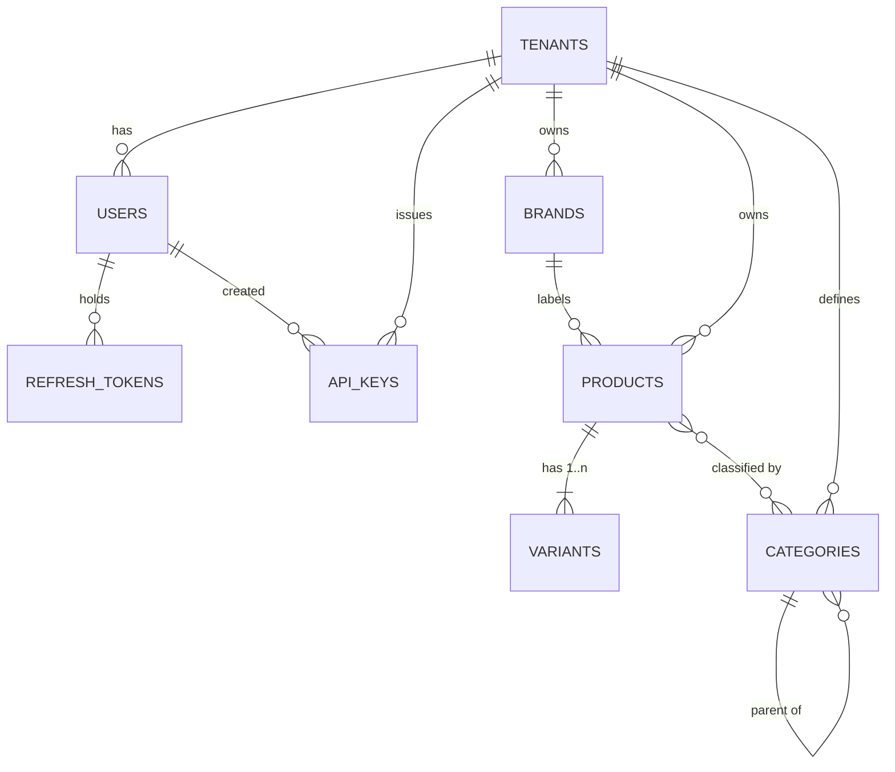

# Fase 1 — Catalog & Foundation · Model Data

**10 tabel.** Belum ada skema sebelumnya — fase ini yang membuat database. Constraint ditandai
dengan aturan yang ditegakkannya (`BR-xxx`, lihat `02-business-rules.md`).

---

## 1. Relasi entitas



`product_categories` adalah tabel penghubung di balik relasi many-to-many, dan tabel inilah yang
membuat satu produk bisa berada di beberapa pohon dengan `kind` berbeda sekaligus.

---

## 2. Konvensi

Berlaku untuk setiap tabel di setiap fase.

- **Key** berupa `uuid` v7, dibuat di sisi aplikasi (BR-005).
- **Uang** berupa `bigint` dalam satuan terkecil ditambah mata uang `char(3)`. `2000000` + `IDR`
  adalah Rp 20.000 (BR-006).
- **Timestamp** berupa `timestamptz`, selalu UTC (BR-007).
- **Arsipkan, jangan hapus** lewat `archived_at timestamptz` pada brands, kategori, produk,
  dan varian (BR-012).
- **Konkurensi optimistik** lewat `version integer NOT NULL DEFAULT 1` pada brands, kategori,
  produk, dan varian. Nilainya dicek di predikat `UPDATE … WHERE version = $n` dan diekspos
  sebagai header `If-Match` (BR-010).
- **Setiap tabel tenant** mendapat `ENABLE` + `FORCE ROW LEVEL SECURITY` dan policy
  `tenant_isolation` (BR-001). Ditulis sekali di bawah; anggap berlaku di semua tabel.
- **`tenant_id` salinan pada tabel anak** dijaga oleh foreign key komposit ke `(id, tenant_id)`
  milik tabel induk (BR-004).

---

## 3. DDL

### 3.1 Extension dan helper bersama

```sql
CREATE EXTENSION IF NOT EXISTS ltree;      -- categories.path
CREATE EXTENSION IF NOT EXISTS unaccent;   -- slugify
CREATE EXTENSION IF NOT EXISTS pg_trgm;    -- pencarian judul produk
CREATE EXTENSION IF NOT EXISTS citext;     -- users.email, lihat 3.2

-- BR-001. Berlaku di setiap tabel milik tenant. Ditulis sekali, anggap ada di mana-mana.
-- CREATE POLICY tenant_isolation ON <table>
--     USING      (tenant_id = current_setting('app.tenant_id', true)::uuid)
--     WITH CHECK (tenant_id = current_setting('app.tenant_id', true)::uuid);

-- P1-006 membungkus ketiga statement itu dalam enable_tenant_rls(regclass), jadi
-- migrasi tabel cukup satu baris dan tidak bisa benar tiga dari empat statement saja.
```

### 3.2 Platform

```sql
CREATE TABLE tenants (
    id         uuid PRIMARY KEY,
    name       text NOT NULL,
    slug       text NOT NULL UNIQUE,
    timezone   text NOT NULL DEFAULT 'Asia/Jakarta',
    currency   char(3) NOT NULL DEFAULT 'IDR',
    status     text NOT NULL DEFAULT 'active'
               CHECK (status IN ('active','suspended','closed')),
    created_at timestamptz NOT NULL DEFAULT now()
);
-- tenants sendiri tidak ber-RLS; tabel ini hanya dijangkau lewat jalur auth.

CREATE TABLE users (
    id            uuid PRIMARY KEY,
    tenant_id     uuid NOT NULL REFERENCES tenants(id),
    email         citext NOT NULL,
    password_hash text,                 -- null selama diundang; token undangan
                                        -- ditandatangani dan kedaluwarsa, tidak disimpan (BR-026)
    name          text NOT NULL,
    role          text NOT NULL DEFAULT 'viewer'
                  CHECK (role IN ('owner','admin','ops','warehouse','viewer')),
    status        text NOT NULL DEFAULT 'invited'
                  CHECK (status IN ('invited','active','disabled')),
    last_login_at timestamptz,
    created_at    timestamptz NOT NULL DEFAULT now(),
    UNIQUE (email)                      -- BR-020
);
-- Email unik di seluruh sistem, bukan per tenant.
--
-- Alternatifnya, UNIQUE (tenant_id, email), membuat satu orang bisa punya akun di
-- beberapa merchant -- tapi login jadi tidak bisa dijawab. `POST /v1/auth/login`
-- hanya membawa email dan password, jadi kalau email yang sama ada di dua tenant,
-- tidak ada apa pun di request untuk memilih di antara keduanya. Keunikan global
-- membuat baris user itu sendiri yang menyatakan tenant pemiliknya.
--
-- Biayanya nyata dan diterima: agensi yang mengelola dua merchant butuh dua
-- alamat email. Tinjau ulang hanya bersama alur login yang membawa workspace.
ALTER TABLE tenants ADD CONSTRAINT tenants_id_uq UNIQUE (id);

CREATE TABLE refresh_tokens (
    id         uuid PRIMARY KEY,
    tenant_id  uuid NOT NULL REFERENCES tenants(id),
    user_id    uuid NOT NULL REFERENCES users(id) ON DELETE CASCADE,
    token_hash text NOT NULL,           -- SHA-256; plaintext hanya ada di cookie
    -- BR-022. Rantai rotasi: token yang dipakai ulang (sudah dirotasi) berarti dicuri.
    -- Cabut seluruh rantainya, bukan sekadar menolak satu request itu.
    rotated_from uuid REFERENCES refresh_tokens(id),
    expires_at timestamptz NOT NULL,
    revoked_at timestamptz,
    created_at timestamptz NOT NULL DEFAULT now(),
    UNIQUE (token_hash)
);
CREATE INDEX ON refresh_tokens (user_id) WHERE revoked_at IS NULL;

CREATE TABLE api_keys (
    id          uuid PRIMARY KEY,
    tenant_id   uuid NOT NULL REFERENCES tenants(id),
    name        text NOT NULL,
    key_hash    text NOT NULL UNIQUE,   -- SHA-256; plaintext ditampilkan sekali saat dibuat (BR-028)
    key_prefix  text NOT NULL,          -- 'bk_live_' + 4 karakter, supaya user bisa membedakan key
    permissions text[] NOT NULL DEFAULT '{}',
    created_by  uuid REFERENCES users(id),
    last_used_at timestamptz,
    revoked_at  timestamptz,
    created_at  timestamptz NOT NULL DEFAULT now()
);
```

### 3.3 Katalog

```sql
CREATE TABLE brands (
    id         uuid PRIMARY KEY,
    tenant_id  uuid NOT NULL REFERENCES tenants(id),
    name       text NOT NULL,
    slug       text NOT NULL,           -- diturunkan dari name, tidak pernah dari klien (BR-030)
    -- BR-030. Marketplace punya registri brand sendiri dan menolak listing yang
    -- brand id-nya tidak mereka kenal. Pemetaannya disimpan di sini supaya diisi sekali
    -- per brand, bukan diulang di setiap produk. Dipakai ekspor CSV Fase 1
    -- dan, mulai Fase 3, oleh listing publisher.
    --   {"shopee": "12345", "tokopedia": "998", "tiktok": "abc"}
    channel_brand_ids jsonb NOT NULL DEFAULT '{}'::jsonb,
    version    integer NOT NULL DEFAULT 1,
    archived_at timestamptz,
    created_at timestamptz NOT NULL DEFAULT now(),
    updated_at timestamptz NOT NULL DEFAULT now(),
    UNIQUE (tenant_id, slug)
);
CREATE INDEX ON brands (tenant_id) WHERE archived_at IS NULL;
ALTER TABLE brands ADD CONSTRAINT brands_id_tenant_uq UNIQUE (id, tenant_id);

CREATE TABLE categories (
    id         uuid PRIMARY KEY,
    tenant_id  uuid NOT NULL REFERENCES tenants(id),
    parent_id  uuid REFERENCES categories(id),
    -- BR-031. Pohon-pohon independen; satu produk boleh berada di beberapa sekaligus.
    kind       text NOT NULL DEFAULT 'category'
               CHECK (kind IN ('category','series','collection','activity','custom')),
    name       text NOT NULL,
    path       ltree NOT NULL,          -- diturunkan oleh trigger, tidak pernah dari klien (BR-032)
    version    integer NOT NULL DEFAULT 1,
    archived_at timestamptz,
    created_at timestamptz NOT NULL DEFAULT now(),
    updated_at timestamptz NOT NULL DEFAULT now(),
    UNIQUE (tenant_id, kind, path)
);
CREATE INDEX ON categories USING gist (path);
CREATE INDEX ON categories (tenant_id, kind, parent_id);
ALTER TABLE categories ADD CONSTRAINT categories_id_tenant_uq UNIQUE (id, tenant_id);

CREATE TABLE products (
    id           uuid PRIMARY KEY,
    tenant_id    uuid NOT NULL REFERENCES tenants(id),
    title        text NOT NULL,
    description  text,
    brand_id     uuid REFERENCES brands(id),   -- nullable: tidak semua produk punya brand
    status       text NOT NULL DEFAULT 'draft'          -- BR-037
                 CHECK (status IN ('draft','active','archived')),
    -- Atribut yang berbeda per kategori dan per marketplace, yang kalau dibuat satu kolom
    -- per field akan jadi migrasi setiap kali sebuah channel mengubah persyaratannya.
    --   {"material":"Cotton Combed 30s",
    --    "channel":{"shopee":{"category_id":"100017"}}}
    -- Jangan taruh di sini apa pun yang Anda filter, urutkan, atau wajibkan unik.
    attributes   jsonb NOT NULL DEFAULT '{}'::jsonb,
    -- BR-040. Sumbu opsi berurutan, mis. ['Colour','Size']; Colour di posisi 0
    -- bila ada. variants.option_values posisional terhadap array INI --
    -- pasangan itulah yang membuat matrix editor cukup pivot, bukan join.
    option_names text[] NOT NULL DEFAULT '{}',
    version      integer NOT NULL DEFAULT 1,
    archived_at  timestamptz,
    created_at   timestamptz NOT NULL DEFAULT now(),
    updated_at   timestamptz NOT NULL DEFAULT now()
);
CREATE INDEX ON products (tenant_id, status) WHERE archived_at IS NULL;
CREATE INDEX ON products (tenant_id, brand_id) WHERE archived_at IS NULL;
CREATE INDEX ON products USING gin (attributes jsonb_path_ops);
CREATE INDEX ON products USING gin (title gin_trgm_ops);   -- kotak pencarian
ALTER TABLE products ADD CONSTRAINT products_id_tenant_uq UNIQUE (id, tenant_id);
ALTER TABLE products ADD CONSTRAINT products_same_tenant_as_brand   -- BR-004
    FOREIGN KEY (brand_id, tenant_id) REFERENCES brands (id, tenant_id);

CREATE TABLE variants (
    id            uuid PRIMARY KEY,
    tenant_id     uuid NOT NULL REFERENCES tenants(id),
    product_id    uuid NOT NULL REFERENCES products(id) ON DELETE CASCADE,
    sku           text,          -- nullable selama draft (BR-039); wajib untuk publish (BR-038)
    barcode       text,
    -- Posisional terhadap products.option_names: ['Black','S']
    option_values text[] NOT NULL DEFAULT '{}',
    price_amount  bigint NOT NULL DEFAULT 0 CHECK (price_amount >= 0),
    compare_at_amount bigint CHECK (compare_at_amount IS NULL OR compare_at_amount >= 0),
    currency      char(3) NOT NULL DEFAULT 'IDR',
    weight_grams  integer NOT NULL DEFAULT 0 CHECK (weight_grams >= 0),
    -- BR-015: tidak ada kolom kuantitas, di fase mana pun. Stok adalah properti dari
    -- (variant, location) dan tinggal di ledger mulai Fase 4. buffer_qty
    -- juga ditambahkan lewat ALTER di Fase 4.
    archived_at   timestamptz,
    version       integer NOT NULL DEFAULT 1,
    created_at    timestamptz NOT NULL DEFAULT now(),
    updated_at    timestamptz NOT NULL DEFAULT now()
);
-- BR-039. Partial unique index, bukan constraint UNIQUE: SKU opsional, jadi
-- banyak variant boleh ber-sku IS NULL sementara yang non-null tetap unik.
CREATE UNIQUE INDEX variants_tenant_sku_uq
    ON variants (tenant_id, sku) WHERE sku IS NOT NULL;
CREATE INDEX ON variants (tenant_id, product_id);
-- BR-040: satu variant hidup per kombinasi opsi. Diff matrix berpatokan padanya.
CREATE UNIQUE INDEX variants_product_options_uq
    ON variants (product_id, option_values) WHERE archived_at IS NULL;
ALTER TABLE variants ADD CONSTRAINT variants_id_tenant_uq UNIQUE (id, tenant_id);
ALTER TABLE variants ADD CONSTRAINT variants_same_tenant_as_product  -- BR-004
    FOREIGN KEY (product_id, tenant_id) REFERENCES products (id, tenant_id);

CREATE TABLE product_categories (
    tenant_id   uuid NOT NULL REFERENCES tenants(id),
    product_id  uuid NOT NULL,
    category_id uuid NOT NULL,
    PRIMARY KEY (product_id, category_id),
    -- BR-004: kedua sisi harus milik tenant baris ini.
    CONSTRAINT product_categories_same_tenant_as_product
        FOREIGN KEY (product_id, tenant_id) REFERENCES products (id, tenant_id) ON DELETE CASCADE,
    CONSTRAINT product_categories_same_tenant_as_category
        FOREIGN KEY (category_id, tenant_id) REFERENCES categories (id, tenant_id) ON DELETE CASCADE
);
CREATE INDEX ON product_categories (tenant_id, category_id);

CREATE TABLE product_media (
    id         uuid PRIMARY KEY,
    tenant_id  uuid NOT NULL REFERENCES tenants(id),
    product_id uuid NOT NULL,
    variant_id uuid,                                  -- null = tingkat produk
    r2_key     text NOT NULL,      -- object key, tidak pernah URL (BR-050)
    mime_type  text NOT NULL,
    bytes      bigint NOT NULL,
    width      integer,
    height     integer,
    position   integer NOT NULL DEFAULT 0,
    derivatives jsonb NOT NULL DEFAULT '{}'::jsonb,  -- {"800":"…/x_800.webp"}
    created_at timestamptz NOT NULL DEFAULT now(),
    -- BR-004. SET NULL (variant_id) hanya mengosongkan variant, tidak pernah tenant_id.
    CONSTRAINT product_media_same_tenant_as_product
        FOREIGN KEY (product_id, tenant_id) REFERENCES products (id, tenant_id) ON DELETE CASCADE,
    CONSTRAINT product_media_same_tenant_as_variant
        FOREIGN KEY (variant_id, tenant_id) REFERENCES variants (id, tenant_id)
        ON DELETE SET NULL (variant_id)
);
CREATE INDEX ON product_media (tenant_id, product_id, position);
```

`product_media` adalah tabel kesepuluh dan tidak ada di daftar fase, tetapi gambar produk tidak
punya tempat lain, dan Fase 1 satu-satunya tempat yang masuk akal untuknya.

### 3.4 Trigger path kategori

Menegakkan BR-032 (path diturunkan, subtree ditulis ulang dalam satu statement), BR-034 (tanpa
siklus), dan BR-035 (saudara bernama sama dibedakan).

```sql
-- Label ltree hanya menerima [A-Za-z0-9_], jadi nama di-slugify.
CREATE OR REPLACE FUNCTION slugify_label(txt text) RETURNS text AS $$
  SELECT regexp_replace(
           regexp_replace(lower(unaccent(coalesce(txt,''))), '[^a-z0-9]+', '_', 'g'),
           '^_+|_+$', '', 'g');
$$ LANGUAGE sql IMMUTABLE;

-- BEFORE: hitung path milik baris ini sendiri.
CREATE OR REPLACE FUNCTION categories_set_path() RETURNS trigger AS $$
DECLARE
  parent_path ltree;
  base text; label text; candidate ltree; n int := 0;
BEGIN
  base := slugify_label(NEW.name);
  IF base = '' THEN base := 'cat'; END IF;

  IF NEW.parent_id IS NOT NULL THEN
    SELECT path INTO STRICT parent_path FROM categories WHERE id = NEW.parent_id;
    -- Kategori tidak boleh dipindah ke bawah turunannya sendiri.
    IF TG_OP = 'UPDATE' AND parent_path <@ OLD.path THEN
      RAISE EXCEPTION 'cannot move category % beneath its own descendant', NEW.id;
    END IF;
  END IF;

  -- Dua saudara bernama "Jackets" menghasilkan slug yang sama; bedakan.
  label := base;
  LOOP
    candidate := CASE WHEN parent_path IS NULL
                      THEN label::ltree ELSE parent_path || label::ltree END;
    EXIT WHEN NOT EXISTS (
      SELECT 1 FROM categories
       WHERE tenant_id = NEW.tenant_id AND kind = NEW.kind
         AND path = candidate AND id IS DISTINCT FROM NEW.id);
    n := n + 1;
    label := base || '_' || n;
  END LOOP;

  NEW.path := candidate;
  RETURN NEW;
END $$ LANGUAGE plpgsql;

CREATE TRIGGER categories_path_biu
  BEFORE INSERT OR UPDATE OF name, parent_id ON categories
  FOR EACH ROW EXECUTE FUNCTION categories_set_path();

-- AFTER: pindahkan setiap turunan saat path baris ini berubah.
CREATE OR REPLACE FUNCTION categories_move_subtree() RETURNS trigger AS $$
BEGIN
  -- UPDATE di bawah memicu ulang trigger ini di setiap turunan, yang sudah
  -- dipindahkan oleh statement tunggal itu. Berhenti di kedalaman 1.
  IF pg_trigger_depth() > 1 THEN RETURN NULL; END IF;

  IF NEW.path IS DISTINCT FROM OLD.path THEN
    UPDATE categories
       SET path = NEW.path || subpath(path, nlevel(OLD.path))
     WHERE tenant_id = NEW.tenant_id
       AND path <@ OLD.path
       AND id <> NEW.id;
  END IF;
  RETURN NULL;
END $$ LANGUAGE plpgsql;

CREATE TRIGGER categories_move_aiu
  AFTER UPDATE OF path ON categories
  FOR EACH ROW EXECUTE FUNCTION categories_move_subtree();
```

---

## 4. Konsekuensi yang diputuskan dengan sengaja

### 4.1 SKU yang nullable

Tiga alur berpatokan pada SKU, semuanya di fase berikutnya: `POST /products/bulk` melakukan upsert
berdasarkan SKU (Fase 2), `POST /products/import` mencocokkan baris berdasarkan SKU (Fase 2), dan
autodiscovery listing marketplace mencocokkan item berdasarkan SKU (Fase 3). Karena itu, varian
dengan `sku IS NULL` tidak bisa di-upsert, diimpor, atau dipetakan otomatis — varian itu hanya
bisa dibuat lalu diedit berdasarkan id.

Itu kompromi yang tepat untuk draft yang masih disusun merchandiser, dan keadaan yang salah untuk
apa pun yang sudah dipublikasikan. Jadi SKU ditegakkan saat produk dipublikasikan (publish check
BR-038), bukan saat varian di-insert. Mulai Fase 3, varian tanpa SKU juga tidak bisa dipasang ke
listing channel.

### 4.2 Tidak ada kolom kuantitas, selamanya (BR-015)

Tidak ada `qty` di `variants` dan tidak akan pernah ada. Kuantitas adalah properti dari
*(varian, location)*, dan itu pun diturunkan dari ledger append-only, bukan disimpan sebagai
kebenaran — lihat `phase-4/Data model - ERD.md`.

Menaruh `qty` di sini akan mengorbankan empat hal sekaligus: multi-gudang jadi mustahil, jejak
audit hilang ("kenapa stoknya 40?" tidak bisa dijawab), setiap order untuk varian mana pun dari
satu produk berebut baris yang sama, dan *on hand* jadi tidak bisa dibedakan dari *reserved* —
padahal pembedaan itulah yang mencegah oversell.

Di Fase 1–3 stok memang tidak terbatas. Itu keputusan ruang lingkup, bukan keputusan model data,
dan model data tidak perlu berubah untuk mengakomodasinya.

---

## 5. Yang ditambahkan fase berikutnya ke tabel-tabel ini

Tidak ada bagian Fase 1 yang dihapus atau diganti nama nanti. Tambahannya:

| Fase | Perubahan pada tabel Fase 1 |
|---|---|
| 2 | Tidak ada. Fase 2 murni menambah |
| 3 | Tidak ada. `channel_listings` mereferensikan `variants` dari sisi baru |
| 4 | `ALTER TABLE variants ADD COLUMN buffer_qty integer NOT NULL DEFAULT 0` |

Fase 1 bertahan melewati tiga fase tanpa migrasi destruktif — itulah alasan meluangkan waktu untuk
model ini sekarang.
