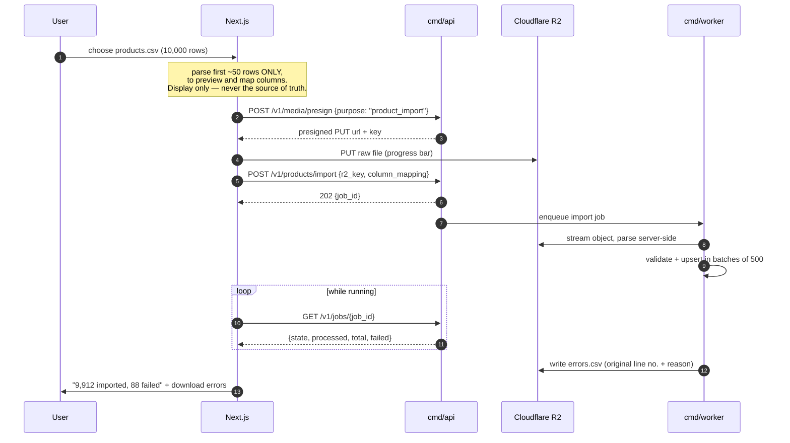
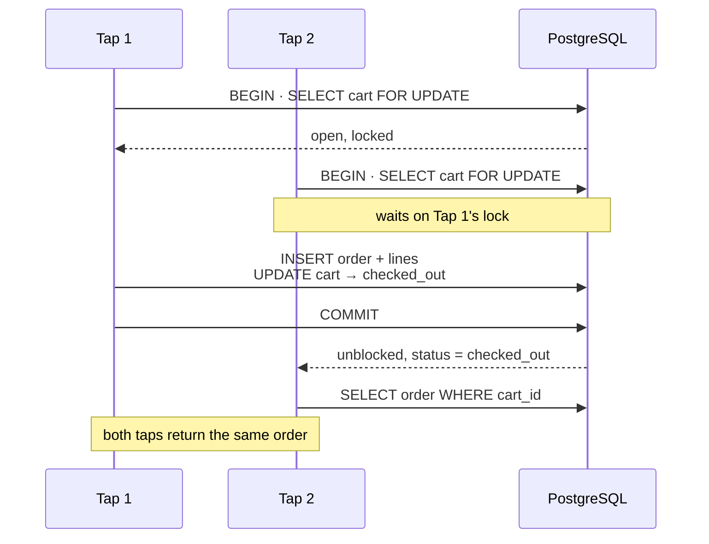

# Ecommerce Backoffice v2 · API Specification

**Two route trees, one contract.** Admin routes live under `/v1` and serve the Next.js admin only.
Storefront routes live under `/v1/storefront` and are what each owner's own website is built on.
Every endpoint lists the permission or credential it needs and the rules it enforces (`BR-xxx`,
see `02-business-rules.md`). Schema is in `03-erd.md`.

`openapi.yaml` is the machine-readable copy. A path appears there when the backlog item that builds
it is done (`05-backlog.md`). For anything both files describe, they must agree: change one, change
the other, in the same commit.

---

## 1. Conventions

| Concern | Rule |
|---|---|
| Base | `https://api.{domain}/v1`. Version in the path; a breaking change gets `/v2` |
| Auth (admin) | `Authorization: Bearer <JWT>`, 15-minute access token, rotating refresh in an httpOnly cookie (BR-022). Admin routes accept nothing else |
| Auth (storefront) | `X-Api-Key: sf_live_…` on every request, plus `Authorization: Bearer <customer token>` or `X-Order-Token` where personal data is involved (§11.1) |
| Auth (webhook) | `POST /v1/webhooks/midtrans/{webhook_id}` only: authenticated by Midtrans' `signature_key` and confirmed with the Get Status API (BR-124, §11.10) |
| Tenant | From the staff token, the API key or a verified webhook, **never** from a header, query or body (BR-003) |
| Content type | `application/json; charset=utf-8` |
| Casing | `snake_case` in JSON, matching the database, so no translation layer can drift |
| Ids | UUID strings (BR-005). Storefront products are addressed by `slug`, orders by `order_number` |
| Money | A plain integer in minor units: `2000000` is Rp 20.000. Always IDR, so no currency field (BR-006) |
| Time | RFC 3339 with the WIB offset: `2026-10-06T16:15:00+07:00`. Input must carry an offset, else `422`; a date-only filter means midnight WIB (BR-007) |
| Server-managed fields | `id`, `tenant_id`, `version`, `created_at`, `updated_at`, `path`, `*_at` audit stamps, brand `slug`: sending one is `422`, on create and update alike (BR-008) |
| Unknown fields | `422 unknown_field`, never ignored. In particular, any price field on a cart or checkout route (BR-089) |
| Omitted vs `null` | Create: omitted takes the default, `null` is `422`. `PATCH`: omitted is unchanged, `null` clears a nullable field (BR-009) |
| Concurrency | `If-Match: <version>` on every `PATCH` to products, variants and orders, and on `PUT` variant-matrix; stale → `409 version_conflict` (BR-010) |
| Idempotency | No `Idempotency-Key` header. Checkout is idempotent per cart (BR-088); transitions are idempotent because moving to the current status is a no-op (BR-071) |
| Responses | Every field is always present; an empty optional field is `null`. References expand to `{id, name}` |
| Collections | `{ "data": [...], "next_cursor": "…" }`; `next_cursor` is `null` on the last page. Unpaginated collections omit it. `GET /v1/roles` is the one bare array |
| Pagination | Cursor only: `?limit=50&cursor=<opaque>`, `limit` 1–200. No `offset` |
| Sorting | `?sort=-placed_at` (leading `-` for descending), allow-listed per endpoint |
| Filtering | Explicit query parameters, not a query DSL |
| Delete | Catalog `DELETE` archives and returns `204` (BR-012) |

### 1.1 Errors

Every error is RFC 9457 `application/problem+json` (BR-011):

```json
{
  "type": "https://docs.{domain}/errors/item_unavailable",
  "title": "Item unavailable",
  "status": 409,
  "detail": "2 items in this cart are no longer sold. Remove them and try again.",
  "instance": "/v1/storefront/carts/7c1e…/checkout",
  "trace_id": "4bf92f3577b34da6a3ce929d0e0e4736",
  "errors": [
    { "field": "items", "variant_id": "01926f…", "sku": "TS-BLK-XL",
      "title": "Erigo Basic Tee — Black / XL" }
  ]
}
```

The code is the last segment of `type`. Each `errors[]` entry always carries `field` and may carry
whatever that failure needs.

| Code | Status | When | BR |
|---|---|---|---|
| `validation_failed` | 422 | Bad body, failed validation, server-managed field sent, `null` where not allowed, missing `If-Match` | 008, 009 |
| `unknown_field` | 422 | A field the endpoint does not define | 089 |
| `publish_check_failed` | 422 | `draft → active` failed; one `errors[]` entry per failure | 038 |
| `empty_cart` | 422 | Checkout of a cart with no items | 090 |
| `unauthenticated` | 401 | Staff credentials missing, expired or invalid; every failed login | 021 |
| `invalid_api_key` | 401 | `X-Api-Key` missing, unknown or revoked | 085 |
| `customer_auth_required` | 401 | Customer or order token missing, invalid, expired, or for another tenant | 082, 086 |
| `permission_denied` | 403 | `detail` names the permission required | 024 |
| `origin_not_allowed` | 403 | Browser request from an origin not on the key's allowlist | 083 |
| `not_found` | 404 | Not in this tenant (or not this customer's), including other tenants' rows | 011 |
| `version_conflict` | 409 | Stale `If-Match` | 010 |
| `duplicate_sku` | 409 | SKU already used in this tenant; `detail` names the product | 039 |
| `category_in_use` | 409 | Deleting a category with children or products | 036 |
| `illegal_transition` | 409 | Order status move not in the allow-list | 070 |
| `item_unavailable` | 409 | Checkout of a cart holding variants no longer visible | 090 |
| `shipping_unavailable` | 409 | The chosen courier service is no longer offered for this cart and destination | 121 |
| `rate_limited` | 429 | Over the limit; `Retry-After` and `RateLimit-*` headers | 014 |
| `channel_unavailable` | 502 | Marketplace API failed during connect | 102 |
| `shipping_rates_unavailable` | 502 | Biteship failed or timed out | 121 |
| `payment_unavailable` | 502 | Midtrans failed to create a Snap transaction; the order exists and payment can be retried | 126 |
| `internal` | 500 | Anything unexpected. `detail` is deliberately generic; `trace_id` is the lead | 011 |

### 1.2 Rate limits

Limits per caller are BR-014. Every response carries `RateLimit-Limit`, `RateLimit-Remaining` and
`RateLimit-Reset`.

---

## 2. Staff auth and identity

| Method | Path | Permission | BR |
|---|---|---|---|
| `POST` | `/v1/auth/login` | none | 020, 021, 022 |
| `POST` | `/v1/auth/refresh` | refresh cookie | 022 |
| `POST` | `/v1/auth/logout` | signed in | 022 |
| `POST` | `/v1/auth/accept-invite` | none (invite token) | 026 |
| `GET` | `/v1/me` | signed in | — |
| `PATCH` | `/v1/me` | signed in | 009 |

Tenants are created by the platform team, not through this API. The owner then accepts an
invitation like anyone else.

### Login

```json
POST /v1/auth/login
{ "email": "ops@erigo.co.id", "password": "…" }

200 OK   ← refresh token set as an httpOnly, Secure, SameSite=Lax cookie
{ "access_token": "eyJ…", "expires_in": 900,
  "user":   { "id": "0192…", "name": "Budi", "role": "ops",
              "permissions": ["orders:read", "orders:write", "…"] },
  "tenant": { "id": "0192…", "name": "Erigo", "timezone": "Asia/Jakarta" } }
```

This body is a **Session**; `refresh` and `accept-invite` return it too. The tenant comes from the
user row (BR-020): there is no tenant, workspace or subdomain parameter. Wrong password, unknown
email and disabled account all return the same `401` (BR-021).

### Refresh and logout

```
POST /v1/auth/refresh      (no body; reads the cookie)  → 200 Session, new cookie
POST /v1/auth/logout       (no body; reads the cookie)  → 204, cookie cleared
```

Every `refresh` rotates; reusing a rotated token revokes the whole chain (BR-022). `refresh` needs
no access token because it is called *after* the access token expires. `logout` is idempotent: a
second call, or one with no cookie, is still `204`.

### Accepting an invitation

```json
POST /v1/auth/accept-invite
{ "token": "inv_9c2e…", "password": "at-least-8-chars" }

200 OK   ← Session + refresh cookie: the user is signed in straight away
```

An expired or already-used token is `422` on `token` (BR-026).

### Me

```json
GET /v1/me
200 OK
{ "user":   { "id": "0192…", "email": "ops@erigo.co.id", "name": "Budi", "role": "ops",
              "permissions": ["orders:read", "…"] },
  "tenant": { "id": "0192…", "name": "Erigo", "timezone": "Asia/Jakarta" } }

PATCH /v1/me
{ "name": "Budi Santoso" }
200 OK   ← same body as GET /v1/me
```

`name` is the only editable field. Staff password change and reset are not in v2.

---

## 3. Roles and permissions

Four seeded, fixed roles (BR-023). A permission is `resource:action`, with `read` or `write`.

| Permission | `owner` | `admin` | `ops` | `viewer` |
|---|:--:|:--:|:--:|:--:|
| `products:read` | ✓ | ✓ | ✓ | ✓ |
| `products:write` | ✓ | ✓ | | |
| `variants:read` | ✓ | ✓ | ✓ | ✓ |
| `variants:write` | ✓ | ✓ | | |
| `categories:read` | ✓ | ✓ | ✓ | ✓ |
| `categories:write` | ✓ | ✓ | | |
| `brands:read` | ✓ | ✓ | ✓ | ✓ |
| `brands:write` | ✓ | ✓ | | |
| `media:read` | ✓ | ✓ | ✓ | ✓ |
| `media:write` | ✓ | ✓ | | |
| `orders:read` | ✓ | ✓ | ✓ | ✓ |
| `orders:write` | ✓ | ✓ | ✓ | |
| `customers:read` | ✓ | ✓ | ✓ | ✓ |
| `exports:read` | ✓ | ✓ | ✓ | ✓ |
| `channels:read` | ✓ | ✓ | | ✓ |
| `channels:write` | ✓ | ✓ | | |
| `users:read` | ✓ | ✓ | | |
| `users:write` | ✓ | ✓ | | |
| `api_keys:read` | ✓ | ✓ | | |
| `api_keys:write` | ✓ | ✓ | | |
| `audit_log:read` | ✓ | ✓ | | |
| `settings:read` | ✓ | ✓ | | ✓ |
| `settings:write` | ✓ | | | |

- **`owner` is `admin` plus `settings:write`, nothing more.** Settings hold the tenant itself and,
  later, billing.
- **`ops` works orders and customers and reads the catalog.** v2 makes `ops` read-only on products
  (in v1 it could write them); catalog editing belongs to owner and admin.
- **`ops` does not read settings.** The shop's settings are owner and admin business, read-only for
  `viewer`; `ops` sees no Settings screen at all (BR-025). The session already carries the time
  zone `ops` needs to display times.
- **`orders:write` covers every transition**, manual entry and refund recording. There is no
  separate `orders:cancel`.
- **There is no `customers:write`.** Staff never create customer accounts or touch credentials
  (BR-092).

`403` names the required permission in `detail` (BR-024). The client does not render what the user
cannot do (BR-025).

---

## 4. Settings, users, API keys, audit log

| Method | Path | Permission | BR |
|---|---|---|---|
| `GET` | `/v1/settings` | `settings:read` | 029 |
| `PATCH` | `/v1/settings` | `settings:write` | 009, 029 |
| `GET` | `/v1/storefront-settings` | `settings:read` | 120, 122, 127, 129 |
| `PATCH` | `/v1/storefront-settings` | `settings:write` | 009, 120, 122, 127, 129 |
| `GET` | `/v1/roles` | `users:read` | 023 |
| `GET` | `/v1/users?status=&role=&limit=&cursor=` | `users:read` | — |
| `POST` | `/v1/users/invite` | `users:write` | 020, 023, 026 |
| `POST` | `/v1/users/{id}/resend-invite` | `users:write` | 026 |
| `PATCH` | `/v1/users/{id}` | `users:write` | 023, 027 |
| `DELETE` | `/v1/users/{id}` | `users:write` | 027 |
| `GET` | `/v1/api-keys` | `api_keys:read` | 028 |
| `POST` | `/v1/api-keys` | `api_keys:write` | 028, 083 |
| `PATCH` | `/v1/api-keys/{id}` | `api_keys:write` | 028 |
| `DELETE` | `/v1/api-keys/{id}` | `api_keys:write` | 028, 085 |
| `GET` | `/v1/audit-log?subject_type=&subject_id=&actor_id=&from=&to=&limit=&cursor=` | `audit_log:read` | 018 |

### Settings

```json
GET /v1/settings
200 OK
{ "id": "0192…", "name": "Erigo", "slug": "erigo", "order_prefix": "ERG",
  "timezone": "Asia/Jakarta", "status": "active" }

PATCH /v1/settings
{ "name": "Erigo Apparel", "timezone": "Asia/Makassar" }
200 OK   ← same body as GET
```

`name`, `timezone` and `order_prefix` are editable; a new prefix applies to new orders only.
There is no currency setting: every amount is IDR (BR-029).

### Storefront settings

How the shop's website sells: contact email, Google sign-in, shipping origin and couriers, and
payment methods.

```json
GET /v1/storefront-settings
200 OK
{ "contact_email": "halo@tokoabc.com",
  "google_client_id": "1234-abc.apps.googleusercontent.com",
  "origin_postal_code": "40115",
  "shipping_couriers": ["jne", "jnt", "sicepat", "anteraja"],
  "bank_transfer_enabled": true,
  "bank_transfer_instructions": "Transfer to BCA 123456789 a.n. Toko ABC",
  "midtrans_enabled": true,
  "midtrans_environment": "production",
  "midtrans_client_key": "Mid-client-…",
  "midtrans_server_key_set": true,                 ← the key itself is never returned (BR-129)
  "midtrans_notification_url": "https://api.{domain}/v1/webhooks/midtrans/5b0e…",
  "updated_at": "2026-10-06T16:15:00+07:00" }

PATCH /v1/storefront-settings
{ "midtrans_server_key": "Mid-server-…", "midtrans_enabled": true }
200 OK   ← same body as GET
```

- `midtrans_server_key` is write-only: accepted on `PATCH`, never in a response.
- Enabling `midtrans` without environment, client key and server key set is `422`. Turning off
  both payment methods is `422` (BR-122).
- `origin_postal_code` is 5 digits; `shipping_couriers` must be Biteship courier codes. Shipping
  rates need both (BR-120).
- `midtrans_notification_url` is informational: the API sends it on every Snap transaction
  (BR-124), so the owner only needs to paste it into the Midtrans dashboard if Midtrans asks.
- No `If-Match` (BR-010).

### Roles

```json
GET /v1/roles
200 OK
[ { "name": "owner", "description": "Everything, including the tenant's own settings",
    "permissions": ["products:read", "…", "settings:write"] },
  … ]
```

Constant. The client renders the role picker from it instead of hardcoding §3.

### Users

```json
GET /v1/users?status=invited
200 OK
{ "data": [
    { "id": "0192…", "email": "rina@erigo.co.id", "name": "Rina", "role": "ops",
      "status": "invited", "last_login_at": null, "created_at": "2026-10-06T16:15:00+07:00" } ],
  "next_cursor": null }

POST /v1/users/invite
{ "email": "rina@erigo.co.id", "name": "Rina", "role": "ops" }
201 Created   ← User as above; invitation email sent

POST /v1/users/{id}/resend-invite
204 No Content   ← only while invited; otherwise 422

PATCH /v1/users/{id}
{ "role": "admin" }                 or   { "status": "active" }
200 OK   ← User

DELETE /v1/users/{id}
204 No Content   ← sets status disabled; the row is never deleted
```

- An email already used in any tenant is `422` on `email` (BR-020).
- Only an owner can grant `owner` (BR-023).
- The last active owner cannot be demoted or disabled (BR-027).
- `PATCH` takes `role` and `status` (`active` re-enables a disabled user), without `If-Match`.

### API keys

```json
POST /v1/api-keys
{ "name": "Main website", "allowed_origin": "https://tokoabc.com" }

201 Created
{ "id": "0192…", "name": "Main website",
  "key": "sf_live_3f9a91c2e8…",           ← shown exactly once; never retrievable again
  "allowed_origin": "https://tokoabc.com",
  "created_by": { "id": "0192…", "name": "Budi" },
  "last_used_at": null, "revoked_at": null, "created_at": "2026-10-06T16:15:00+07:00" }

GET /v1/api-keys
200 OK
{ "data": [ …same shape without "key"… ] }    ← unpaginated; revoked keys are not listed

PATCH /v1/api-keys/{id}
{ "allowed_origin": "https://shop.tokoabc.com" }
200 OK   ← ApiKey without "key"

DELETE /v1/api-keys/{id}
204 No Content   ← revokes; stops working within 60 s (BR-085)
```

- `allowed_origin` is required: one exact `scheme://host[:port]`, no path, no wildcard, no
  trailing slash; anything else is `422` (BR-028, BR-083).
- A website on two origins (`tokoabc.com` and `www.tokoabc.com`), or a staging site, needs one
  key per origin.

### Audit log

```json
GET /v1/audit-log?subject_type=order&subject_id=0192…
200 OK
{ "data": [
    { "action": "order.transition",
      "actor": { "id": "0192…", "name": "Budi" },
      "subject_type": "order", "subject_id": "0192…",
      "before": { "status": "paid" }, "after": { "status": "processing" },
      "ip": "203.0.113.7", "created_at": "2026-10-06T16:15:00+07:00" } ],
  "next_cursor": null }
```

`actor` is `null` for system actions (import worker, retention job). Newest first.

---

## 5. Orders and customers (M1)

| Method | Path | Permission | BR |
|---|---|---|---|
| `GET` | `/v1/orders?status=&source=&customer_id=&refund_owed=&placed_from=&placed_to=&q=&sort=&limit=&cursor=` | `orders:read` | 075 |
| `POST` | `/v1/orders` | `orders:write` | 076, 077, 078 |
| `GET` | `/v1/orders/{id}` | `orders:read` | — |
| `PATCH` | `/v1/orders/{id}` | `orders:write` | 009, 010, 079 |
| `POST` | `/v1/orders/{id}/mark-paid` | `orders:write` | 070, 071, 073, 074 |
| `POST` | `/v1/orders/{id}/process` | `orders:write` | 070, 071, 073 |
| `POST` | `/v1/orders/{id}/ship` | `orders:write` | 070, 071, 072, 073 |
| `POST` | `/v1/orders/{id}/complete` | `orders:write` | 070, 071, 073 |
| `POST` | `/v1/orders/{id}/cancel` | `orders:write` | 070, 071, 073 |
| `POST` | `/v1/orders/{id}/refund` | `orders:write` | 075 |
| `POST` | `/v1/orders/export` | `exports:read` | 060, 063, 064, 065 |
| `POST` | `/v1/shipping/rates` | `orders:write` | 120 |
| `GET` | `/v1/customers?q=&limit=&cursor=` | `customers:read` | 092 |
| `GET` | `/v1/customers/{id}` | `customers:read` | 092 |

### 5.1 Order list

```json
GET /v1/orders?status=paid&status=processing&sort=-placed_at
200 OK
{ "data": [
    { "id": "0192…", "order_number": "ERG-000123", "source": "storefront",
      "status": "paid", "version": 2,
      "customer": { "name": "Rina", "email": "rina@example.com", "phone": "+6281234567890" },
      "item_count": 2,
      "total": 39800000,
      "placed_at": "2026-10-06T16:15:00+07:00", "paid_at": "2026-10-06T17:02:00+07:00",
      "refunded_at": null } ],
  "next_cursor": "eyJ…" }
```

- `status` repeats to OR values. The admin's saved views are plain filters:
  **To confirm payment** `status=pending` · **To ship** `status=paid&status=processing` ·
  **Shipped** `status=shipped` · **Cancelled, refund owed** `refund_owed=true` (BR-075).
- `q` matches `order_number`, customer name, email and phone.
- `sort` accepts `-placed_at` (default) and `placed_at`.
- p95 first byte under 800 ms with 10,000 orders in the tenant.

### 5.2 Order detail and edit

```json
GET /v1/orders/{id}
200 OK
{ "id": "0192…", "order_number": "ERG-000123", "source": "storefront", "status": "processing",
  "version": 3,
  "customer_id": "0192…",                              ← null for guest and manual orders
  "customer": { "name": "Rina", "email": "rina@example.com", "phone": "+6281234567890" },
  "shipping_address": { "line1": "Jl. Melati 12", "line2": null, "city": "Bandung",
                        "province": "Jawa Barat", "postal_code": "40115" },
  "note": "Tolong dibungkus kado",
  "lines": [
    { "id": "0192…", "variant_id": "0192…", "sku": "TS-BLK-M",
      "title": "Erigo Basic Tee — Black / M", "qty": 2,
      "unit_price": 19900000,
      "discount": 0 } ],
  "subtotal": 39800000,
  "shipping": 0,
  "discount": 0,
  "total":    39800000,
  "payment_method": "midtrans",
  "payments": [                                         ← Midtrans attempts, newest first
    { "provider_order_id": "ERG-000123", "status": "paid",
      "transaction_status": "settlement", "amount": 39800000,
      "paid_at": "…", "created_at": "…" } ],
  "shipping_courier": "jne", "shipping_service": "reg",  ← what the shopper chose
  "courier": null, "tracking_number": null,
  "placed_at": "…", "paid_at": "…", "shipped_at": null, "completed_at": null,
  "cancelled_at": null, "refunded_at": null,
  "allowed_transitions": ["shipped", "cancelled"] }

PATCH /v1/orders/{id}          If-Match: 3
{ "shipping_address": { … }, "note": "…", "shipping": 1500000 }
200 OK   ← Order, version 4; totals recomputed
```

`PATCH` accepts only `shipping_address`, `note` and `shipping`, and only while `pending`; otherwise
`422` (BR-079). `allowed_transitions` comes from the allow-list so the client never hardcodes it.

### 5.3 Transitions

Every status route calls the one Transition function (BR-071). None takes `If-Match`: the row lock
and the allow-list are the concurrency control, and the no-op makes repeats harmless.

```
POST /v1/orders/{id}/mark-paid                                → 200 Order
POST /v1/orders/{id}/process                                  → 200 Order
POST /v1/orders/{id}/ship      {"courier": "jne", "tracking_number": "JNE0123456789"}  → 200 Order
POST /v1/orders/{id}/complete                                 → 200 Order
POST /v1/orders/{id}/cancel    {"reason": "Customer asked"}   → 200 Order   (reason optional, audited)
POST /v1/orders/{id}/refund    {"note": "BCA transfer 6 Oct"} → 200 Order   (sets refunded_at)
```

- A move not in the allow-list is `409 illegal_transition` naming from and to; nothing changes.
- Moving to the current status is `200` with the unchanged order.
- `ship` without `tracking_number` is `422` (BR-072). `courier` is a Biteship courier code and
  defaults to the order's `shipping_courier`; a manual order with no chosen courier must send it.
- `mark-paid` works for either payment method. On a Midtrans order it is the operator's override
  (a payment confirmed outside Midtrans); a later notification is then a no-op (BR-074).
- `refund` on an order that is not cancelled, was never paid, or is already refunded is `422`
  (BR-075).

### 5.4 Manual order entry

```json
POST /v1/orders
{ "source": "manual",
  "customer": { "name": "Dewi", "email": null, "phone": "+6281299990000" },
  "shipping_address": { "line1": "Jl. Kenanga 4", "city": "Surabaya",
                        "province": "Jawa Timur", "postal_code": "60231" },
  "lines": [ { "variant_id": "0192…", "qty": 1, "discount": 2000000 } ],
  "shipping": 1500000,
  "note": "Order via WhatsApp" }
                                     ← or "shipping_option": { "courier_code": "jne", "courier_service_code": "reg" }

201 Created   ← Order, status pending
```

Line prices come from `variant_price()` exactly as checkout does (BR-046, BR-078); a `unit_price` in the request
is `422 unknown_field`. Archived variants are `422` naming the line. `source` must be `manual`.
Send either `shipping` (a typed amount) or `shipping_option` (a courier choice, quoted like
checkout, BR-121), not both.
Manual orders are always `bank_transfer`.

#### Shipping rates for a manual order

```json
POST /v1/shipping/rates
{ "destination_postal_code": "60231",
  "lines": [ { "variant_id": "0192…", "qty": 1 } ] }
200 OK   ← same "options" shape as §11.6
```

### 5.5 Customers

```json
GET /v1/customers?q=rina
200 OK
{ "data": [ { "id": "0192…", "name": "Rina", "email": "rina@example.com",
              "phone": "+6281234567890", "order_count": 3,
              "created_at": "2026-10-06T16:15:00+07:00" } ],
  "next_cursor": null }

GET /v1/customers/{id}
200 OK   ← Customer + "orders": [ …order list rows, newest first, up to 50… ]
```

Read-only. No password hash, session or token ever appears (BR-092).

### 5.6 Order export

```json
POST /v1/orders/export
{ "status": ["completed"], "placed_from": "2026-09-01T00:00:00+07:00",
  "placed_to": "2026-10-01T00:00:00+07:00" }

202 Accepted
{ "job_id": "0192…" }
```

Filters match §5.1. One CSV row per order line (BR-065). Poll `GET /v1/jobs/{id}` (§9).

---

## 6. Brands and categories (M2)

| Method | Path | Permission | BR |
|---|---|---|---|
| `GET` | `/v1/brands?q=&archived=false&limit=&cursor=` | `brands:read` | — |
| `POST` | `/v1/brands` | `brands:write` | 030 |
| `GET` | `/v1/brands/{id}` | `brands:read` | — |
| `PATCH` | `/v1/brands/{id}` | `brands:write` | 030 |
| `DELETE` | `/v1/brands/{id}` | `brands:write` | 012 |
| `GET` | `/v1/categories?kind=&parent_id=&depth=` | `categories:read` | 031 |
| `GET` | `/v1/categories/{id}` | `categories:read` | 033 |
| `POST` | `/v1/categories` | `categories:write` | 031, 032, 035 |
| `PATCH` | `/v1/categories/{id}` | `categories:write` | 032, 033, 034, 035 |
| `DELETE` | `/v1/categories/{id}` | `categories:write` | 012, 036 |

### 6.1 Brands

```json
POST /v1/brands
{ "name": "Erigo" }

201 Created
{ "id": "0192…", "name": "Erigo", "slug": "erigo", "archived_at": null,
  "created_at": "2026-10-06T16:15:00+07:00", "updated_at": "2026-10-06T16:15:00+07:00" }

PATCH /v1/brands/{id}
{ "name": "Erigo Apparel" }
200 OK   ← Brand, slug re-derived
```

A name whose slug matches another brand's, archived ones included, is `422` on `name` (BR-030).
No `If-Match`: brands have no `version`, so the last save wins (BR-010).
The list is sorted by `name`; `q` matches the name.

### 6.2 Categories

```json
POST /v1/categories
{ "name": "Jackets", "parent_id": "0192-outerwear", "kind": "category" }

201 Created
{ "id": "0192…", "kind": "category", "name": "Jackets",
  "parent_id": "0192-outerwear", "path": "apparel.outerwear.jackets",
  "archived_at": null, "created_at": "…", "updated_at": "…" }

GET /v1/categories/{id}
200 OK   ← Category plus the counts the move dialog needs:
{ …, "descendant_count": 4, "product_count": 128 }      ← product_count spans the subtree

PATCH /v1/categories/{id}
{ "parent_id": "0192-technical-outerwear" }      or   { "name": "Jackets & Coats" }
200 OK   ← Category with its new path

DELETE /v1/categories/{id}
204 No Content
409 category_in_use
{ …, "errors": [ { "field": "children", "count": 4 }, { "field": "products", "count": 128 } ] }
```

- **`path` is read-only.** The database derives it; sending it is `422` (BR-008, BR-032).
- A rename or move rewrites every descendant's `path` in one statement and leaves product
  assignments alone (BR-033).
- Moving a category beneath its own descendant is `422` on `parent_id` (BR-034).
- `parent_id: null` on `PATCH` makes the category a root.
- No `If-Match`: categories have no `version`, so the last save wins (BR-010). Two moves at once
  still leave a valid tree, because the trigger rewrites paths inside each statement (BR-032).
- **List.** Unpaginated, flat, sorted by `kind` then `path`; the client builds the tree from
  `parent_id`. `kind` limits to one tree, `parent_id` starts below that node, `depth=1` returns one
  level for lazy-loading large trees.

---

## 7. Products and variants (M2)

| Method | Path | Permission | BR |
|---|---|---|---|
| `GET` | `/v1/products?status=&brand_id=&category_id=&q=&sort=&limit=&cursor=` | `products:read` | — |
| `POST` | `/v1/products` | `products:write` | 009, 037, 042 |
| `GET` | `/v1/products/{id}` | `products:read` | — |
| `PATCH` | `/v1/products/{id}` | `products:write` | 009, 010, 037, 038, 042 |
| `DELETE` | `/v1/products/{id}` | `products:write` | 012, 045 |
| `GET` | `/v1/products/{id}/variants?archived=false` | `variants:read` | — |
| `POST` | `/v1/products/{id}/variants` | `variants:write` | 039, 040 |
| `PATCH` | `/v1/variants/{id}` | `variants:write` | 009, 010, 039 |
| `DELETE` | `/v1/variants/{id}` | `variants:write` | 012, 045 |
| `PUT` | `/v1/products/{id}/variant-matrix` | `variants:write` | 010, 039, 040, 041 |
| `POST` | `/v1/products/bulk` | `products:write` + `variants:write` | 039, 043 |
| `POST` | `/v1/products/import` | `products:write` + `variants:write` | 044, 060 |

### 7.1 Products

```json
POST /v1/products
{ "title": "Erigo Basic Tee",
  "brand_id": "0192a1c4-…",
  "category_ids": ["0192-tees", "0192-ss26"],
  "attributes": { "material": "Cotton Combed 30s" } }
```

Only what the user supplied: `status`, `slug` and `version` are **absent**, not `null`.

```json
201 Created
{ "id": "0192b7f0-…",
  "version": 1,                                       ← server-assigned
  "title": "Erigo Basic Tee",
  "slug": "erigo-basic-tee",                          ← derived from title (BR-042)
  "description": null,
  "status": "draft",                                  ← default applied
  "brand": { "id": "0192a1c4-…", "name": "Erigo" },   ← expanded on read
  "categories": [ { "id": "0192-tees", "kind": "category", "name": "Tees",
                    "path": "apparel.tees" }, … ],
  "attributes": { "material": "Cotton Combed 30s" },
  "option_names": [],
  "variant_count": 0,
  "media": [],                                        ← Media objects in position order (§8)
  "archived_at": null,
  "created_at": "2026-10-06T16:15:00+07:00", "updated_at": "2026-10-06T16:15:00+07:00" }
```

`GET /v1/products/{id}` returns the same body.

```json
PATCH /v1/products/{id}        If-Match: 1
{ "description": "Kaos basic 30s", "slug": "basic-tee", "status": "active" }
200 OK   ← Product, version 2
```

- **Slug.** Editable; must be lower-case `a-z0-9-` and unique in the tenant, archived products
  included, else `422` on `slug`. Changing `title` never changes `slug` (BR-042).
- **Clearing.** `null` clears `description` or `brand_id` (BR-009).
- **Replaced whole.** `category_ids` replaces all assignments; `attributes` replaces the object.
- **`option_names`** changes only through the variant matrix (§7.3); sending it here is `422`.
- **Status.** `"active"` runs the publish check (BR-038); `"draft"` unpublishes; `DELETE` archives.

```json
422 publish_check_failed
{ …, "errors": [
    { "field": "variants",   "detail": "At least one live variant is required" },
    { "field": "sku",        "variant_id": "0192…", "detail": "Variant Black / XL has no SKU" },
    { "field": "price",      "variant_id": "0192…", "detail": "Price must be greater than zero" },
    { "field": "weight",     "variant_id": "0192…", "detail": "Weight must be greater than zero" },
    { "field": "media",      "detail": "At least one image is required" },
    { "field": "categories", "detail": "At least one category of kind category is required" } ] }
```

**List.**

```json
GET /v1/products?status=active&category_id=0192-apparel&q=tee&sort=-updated_at
200 OK
{ "data": [
    { "id": "0192…", "version": 3, "title": "Erigo Basic Tee", "slug": "erigo-basic-tee",
      "status": "active", "brand": { "id": "0192…", "name": "Erigo" },
      "categories": [ { "id": "0192…", "name": "Tees", "path": "apparel.tees" } ],
      "variant_count": 10,
      "price_min": 19900000,
      "price_max": 21900000,
      "cover_url": "https://img.{domain}/…/200.webp",
      "updated_at": "2026-10-06T16:15:00+07:00" } ],
  "next_cursor": "eyJ…" }
```

- `categories` lists only the product's categories of kind `category` (the main tree), as
  `{id, name, path}`, sorted by `path`. Series, collections and the other kinds appear in
  `GET /v1/products/{id}`. An empty array means the product is not in the main tree yet, which is
  also why it cannot be published (BR-038).
- `category_id` matches that category **and its descendants**.
- `q` is a trigram match on `title`; an exact SKU also matches.
- `sort` accepts `-created_at` (default), `-updated_at` or `title`.
- Archived products appear only with `status=archived`.
- p95 under 600 ms with 10k products.

### 7.2 Variants

```json
POST /v1/products/{id}/variants
{ "option_values": ["Black", "S"], "sku": "TS-BLK-S",
  "regular_price": 19900000, "weight_grams": 200 }

201 Created
{ "id": "0192…", "product_id": "0192b7f0-…", "version": 1,
  "option_values": ["Black", "S"], "sku": "TS-BLK-S", "barcode": null,
  "regular_price": 19900000,   ← currency defaults to IDR
  "sale_price": null, "sale_starts_at": null, "sale_ends_at": null,
  "price": 19900000,   ← read-only: what a shopper pays now
  "on_sale": false,
  "weight_grams": 200,
  "archived_at": null, "created_at": "…", "updated_at": "…" }

PATCH /v1/variants/{id}        If-Match: 1
{ "sale_price": 14900000,
  "sale_starts_at": "2026-10-10T00:00:00+07:00",
  "sale_ends_at":   "2026-10-13T00:00:00+07:00" }
200 OK   ← Variant, version 2; price becomes 14900000 on 10 Oct and goes back on 13 Oct

GET /v1/products/{id}/variants
200 OK
{ "data": [ …Variant… ] }      ← unpaginated, ordered by option_values
```

- `option_values` has one entry per `option_names` entry and is unique among the product's live
  variants (BR-040). It changes only through the matrix.
- A clashing SKU is `409 duplicate_sku` (BR-039).
- **Prices** (BR-046). `regular_price` and `sale_price` are writable; `price` and `on_sale` are
  read-only and computed by `variant_price()`. A `sale_price` not lower than `regular_price`, or a
  `sale_ends_at` not after `sale_starts_at`, is `422`. `"sale_price": null` ends the sale; the
  schedule fields are optional.

### 7.3 Variant matrix

`PUT /v1/products/{id}/variant-matrix` saves the whole option grid in **one request** (BR-041).
It is declarative ("this is what the grid should be"); the server computes the diff. Erigo's
five-size styles are one request, not five.

```json
PUT /v1/products/{id}/variant-matrix      If-Match: 3      ← the PRODUCT's version
{ "option_names": ["Colour", "Size"],
  "rows": [
    { "option_values": ["Black","S"], "sku": "TS-BLK-S",
      "regular_price": 19900000, "weight_grams": 200 },
    { "option_values": ["Black","M"], "sku": "TS-BLK-M",
      "regular_price": 19900000, "weight_grams": 210 },
    { "option_values": ["Black","XXL"], "sku": "TS-BLK-XXL",
      "regular_price": 21900000, "weight_grams": 240 },
    { "option_values": ["White","S"], "sku": "TS-WHT-S",
      "regular_price": 19900000,
      "sale_price": 14900000, "weight_grams": 200 } ],
  "archive_missing": true }

200 OK
{ "product_version": 4,
  "created": 1, "updated": 2, "restored": 0, "unchanged": 0, "archived": 4, "failed": 1,
  "archived_variant_ids": ["0192…", "…"],
  "results": [
    { "option_values": ["Black","S"],   "status": "updated", "variant_id": "0192…" },
    { "option_values": ["Black","M"],   "status": "updated", "variant_id": "0192…" },
    { "option_values": ["Black","XXL"], "status": "created", "variant_id": "0193…" },
    { "option_values": ["White","S"],   "status": "error",   "variant_id": null,
      "code": "duplicate_sku", "detail": "SKU TS-WHT-S is used by Erigo Oversize Tee" } ] }
```

- **Matching.** Rows match the product's live variants by `option_values`. A row matching an
  archived variant restores it, so a colourway added back keeps its SKU.
- **Fields in a row.** An omitted field is left as it is; `null` clears a nullable one, as on
  `PATCH`. A grid without sale columns therefore never ends a sale by accident.
- **One bad row fails alone.** The rest save and every row gets a result; the response is `200`
  even when some rows fail (BR-041).
- **`archive_missing`.** `true` archives live variants not sent; `false` patches part of the grid
  and archives nothing (the editor uses it for filtered views). Changing `option_names` with
  `archive_missing: false` is `422`.
- **Request-level errors.** A row whose `option_values` does not fit `option_names`, a duplicate
  row, or a Colour axis not at position 0 makes the whole request `422` before anything is written
  (BR-040).
- 100 cells save in under 2 s.

### 7.4 Matrix versus `PATCH /v1/variants/{id}`

| | `variant-matrix` | `PATCH /variants/{id}` |
|---|---|---|
| Scope | Every variant of a product | Exactly one |
| Can create / archive / reshape the grid | Yes | No |
| Usual caller | Save in the matrix editor | Variant detail drawer |
| Concurrency | `If-Match` on the product | `If-Match` on that variant |

Someone fixing one barcode uses `PATCH`. A whole-grid `PUT` for that would overwrite a
merchandiser's concurrent edits.

### 7.5 Bulk upsert

`POST /v1/products/bulk` is not the CSV path. It takes JSON rows from a caller that already holds
structured data: a multi-select action on the product list, or paste-into-grid. Up to 500 items.

```json
{ "on_conflict": "update",
  "items": [
    { "sku": "TS-BLK-S", "status": "active",
      "regular_price": 19900000 },
    { "sku": "TS-BLK-M", "status": "active",
      "sale_price": 14900000,
      "sale_ends_at": "2026-10-13T00:00:00+07:00" } ] }

200 OK
{ "created": 0, "updated": 1, "failed": 1,
  "results": [
    { "index": 0, "sku": "TS-BLK-S", "status": "updated", "variant_id": "0192…" },
    { "index": 1, "sku": "TS-BLK-M", "status": "error",
      "code": "validation_failed", "detail": "sale_price must be lower than regular_price" } ] }
```

- Keyed on `sku` (BR-043). `on_conflict` is `update` or `error`. A row without `sku` creates a
  product with one variant and must carry `title`.
- Item fields: `sku`, `title`, `status`, `regular_price`, `sale_price`, `sale_starts_at`,
  `sale_ends_at`, `weight_grams`, `barcode`.
  `status` applies to the variant's product and runs the publish check.
- Results are indexed by request position. Partial success is the contract: one bad row never
  rolls back the other 499.

### 7.6 CSV import

The CSV path is `/import`, and the browser never parses the file (BR-044).



```json
POST /v1/products/import
{ "r2_key": "0192-tenant/jobs/0193…/upload.csv",
  "column_mapping": { "Nama Produk": "title", "SKU": "sku", "Harga": "regular_price",
                      "Harga Diskon": "sale_price",
                      "Berat": "weight_grams", "Warna": "option:Colour", "Ukuran": "option:Size" },
  "on_conflict": "update" }

202 Accepted
{ "job_id": "0193…" }
```

`column_mapping` is what the preview step produces, so the tenant's own spreadsheet headers need
not match our field names. `option:<Name>` columns build the variant matrix; rows with the same
`title` become one product. Delimiter (`,` or `;`), encoding and BOM are detected server-side.
10,000 variants finish in under 5 minutes.

Prices in the file are whole rupiah (`199000` or `199.000` is Rp 199.000); the API stores minor
units. A row whose SKU exists updates that variant (`on_conflict: update`) or fails as
`duplicate_sku` (`error`); any other row joins the product its `title` names in this file,
created as a draft. A redelivered job resumes after the last batch it committed, so a row is
never applied twice (BR-060).

---

## 8. Media (M2)

| Method | Path | Permission | BR |
|---|---|---|---|
| `POST` | `/v1/media/presign` | `media:write` (or `products:write` for `product_import`) | 051, 053 |
| `POST` | `/v1/media/confirm` | `media:write` | 050, 051 |
| `PATCH` | `/v1/media/{id}` | `media:write` | 009 |
| `DELETE` | `/v1/media/{id}` | `media:write` | 012 |
| `PATCH` | `/v1/products/{id}/media/order` | `media:write` | — |

Uploads go **straight from the browser to R2**; bytes never transit the API (BR-051).

```json
1. POST /v1/media/presign
   { "purpose": "product_image", "product_id": "0192…",
     "mime_type": "image/jpeg", "bytes": 5242880, "sha256": "9f2c…" }
   200 OK
   { "upload_url": "https://…r2…", "r2_key": "0192-tenant/products/0192…/9f2c….jpg",
     "expires_in": 600 }

2. PUT <upload_url>            raw bytes, straight to R2, with a progress bar

3. POST /v1/media/confirm
   { "r2_key": "0192-tenant/products/0192…/9f2c….jpg", "product_id": "0192…", "variant_id": null }
   201 Created
   { "id": "0193…", "product_id": "0192…", "variant_id": null,
     "mime_type": "image/jpeg", "bytes": 5242880, "width": 3000, "height": 4000,
     "position": 0,
     "url": "https://img.{domain}/0192-tenant/products/0192…/9f2c….jpg",
     "derivatives": {},                     ← filled by the worker within ~15 s (BR-052)
     "created_at": "2026-10-06T16:15:00+07:00" }
```

- **Presign.** `purpose` is `product_image` (JPEG, PNG, WebP up to 20 MB) or `product_import`
  (CSV up to 50 MB, no `product_id`); anything else is `422`. The key contains the content hash
  (BR-053).
- **Confirm.** Checks content type and size against R2's `HEAD` before saving the row. A key for an
  object never uploaded is `422`.
- **URLs.** Product images are public on the image domain (BR-053). Once ready, `derivatives` is
  `{ "1600": "https://img.{domain}/…", "800": "…", "200": "…" }`. The product body carries the same
  Media objects.

```json
PATCH /v1/media/{id}
{ "variant_id": "0192…" }          or   { "variant_id": null }    ← attach to a variant / product level
200 OK   ← Media

PATCH /v1/products/{id}/media/order
{ "media_ids": ["0193…", "0194…", "0195…"] }    ← every media id of the product, in the new order
200 OK
{ "data": [ …Media, by position… ] }

DELETE /v1/media/{id}
204 No Content   ← deletes the row; the worker deletes the R2 objects
```

Media has no `version`, so neither `PATCH` takes `If-Match`. An order list that is not exactly the
product's media is `422`.

---

## 9. Jobs

| Method | Path | Permission | BR |
|---|---|---|---|
| `GET` | `/v1/jobs/{id}` | the job's own permission: `products:write` for `product_import`, `exports:read` for `order_export`, `channels:read` for `channel_import` | 060, 063 |

```json
GET /v1/jobs/{id}
200 OK
{ "id": "0193…", "kind": "product_import",
  "state": "done",                          ← queued | running | done | failed
  "processed": 10000, "total": 10000, "failed": 88,
  "created_at": "2026-10-06T16:15:00+07:00", "finished_at": "2026-10-06T16:18:41+07:00",
  "result": {
    "created": 412, "updated": 9500,
    "error_report_url": "https://…", "expires_in": 900 },   ← null when nothing failed
  "error": null }                           ← a Problem when state is failed
```

- `result` is `null` until `state` is `done`. Its counts depend on `kind`: `order_export` carries
  `download_url`; `channel_import` carries `created`, `linked`, `filled`, `unchanged`, `failed`.
- Every `GET` of a finished job signs fresh 15-minute URLs; that is how links are regenerated
  (BR-063).

---

## 10. Marketplace import (M4)

| Method | Path | Permission | BR |
|---|---|---|---|
| `GET` | `/v1/channels` | `channels:read` | — |
| `POST` | `/v1/channels/{kind}/connect` | `channels:write` | 101 |
| `GET` | `/v1/channels/{kind}/callback` | signed `state` | 101 |
| `DELETE` | `/v1/channels/{id}` | `channels:write` | 101 |
| `POST` | `/v1/channels/{id}/import` | `channels:write` | 100, 105 |
| `GET` | `/v1/channels/{id}/listings?q=&limit=&cursor=` | `channels:read` | 103 |
| `DELETE` | `/v1/channel-listings/{id}` | `channels:write` | 108 |

```json
GET /v1/channels
200 OK
{ "data": [
    { "id": "0192…", "kind": "shopee", "name": "Erigo Official Shop",
      "external_shop_id": "123456", "status": "connected",
      "last_imported_at": "2026-10-06T16:15:00+07:00", "last_error": null,
      "listing_count": 412, "running_job_id": null } ] }

POST /v1/channels/shopee/connect
200 OK
{ "authorize_url": "https://partner.shopeemobile.com/…&state=…" }

GET /v1/channels/shopee/callback?code=…&shop_id=…&state=…
302 Found → https://admin.{domain}/channels/0192…?connected=1
```

- **Connect.** The browser is redirected to the marketplace and back to `callback`. The callback
  carries no staff token: `state` is an HMAC-signed, 10-minute value binding tenant, user and kind,
  and it is the only source of the tenant there (BR-003). Reconnecting a `reauth_required` channel
  uses the same flow and updates the existing row.
- **Disconnect.** `DELETE` erases credentials and sets `disconnected`; products and links stay
  (BR-101).

```json
POST /v1/channels/{id}/import
{ "new_products_status": "draft" }       ← or "active"; omit for draft (BR-105)

202 Accepted
{ "job_id": "0193…" }
```

- A second click while an import runs returns `202` with the **running** job's id (BR-100).
- A channel that is not `connected` is `422`.

```json
GET /v1/channels/{id}/listings?q=TS-BLK
200 OK
{ "data": [
    { "id": "0192…", "external_item_id": "2310044", "external_model_id": "88001",
      "variant": { "id": "0192…", "sku": "TS-BLK-S", "title": "Erigo Basic Tee — Black / S" },
      "last_imported_at": "2026-10-06T16:15:00+07:00" } ],
  "next_cursor": null }

DELETE /v1/channel-listings/{id}
204 No Content   ← unlink; variant and product untouched (BR-108)
```

---

## 11. Storefront API (M3)

This is the API owners' websites are built on, so it is the part outside developers read. It is
published as its own OpenAPI document at `/v1/storefront/openapi.json`, separate from the admin one.
Storefront routes never accept a staff token (BR-086).

### 11.1 Credentials

| Routes | Credential | Why |
|---|---|---|
| Catalog: products, categories, brands | `X-Api-Key` | Public data. The key identifies the shop; the origin check stops other websites using it |
| Cart and checkout | `X-Api-Key` + cart id in the path | The cart id is random; holding it is the permission |
| Customer account and order history | `X-Api-Key` + `Authorization: Bearer <customer token>` | Personal data. Never reachable with a key alone |
| Guest order lookup | `X-Api-Key` + `X-Order-Token` from checkout | The token is the guest's proof the order is theirs |

**One kind of key** (BR-028). The owner creates a key with their website's domain and gives it
to their developer. The same key works in browser code (where the domain is checked) and on the
website's own server, such as Next.js or Nuxt rendering on the server (where there is no browser
to check).

### 11.2 The key middleware

Every storefront request runs this before any handler (BR-083, BR-085):

1. Resolve `X-Api-Key` by SHA-256 through `resolve_api_key` (cached ≤ 60 s). Missing, unknown or
   revoked → `401 invalid_api_key`.
2. **Request has an `Origin`** (from a browser): it must exactly match the key's
   `allowed_origin`, else `403 origin_not_allowed` with no `Access-Control-Allow-Origin`. On a match, echo
   the origin and add `Vary: Origin`. Browser rate limits apply.
3. **No `Origin`** (from a server): accepted; server rate limits apply (BR-014).
4. Set the tenant from the key; every query then runs through `InTenantTx` like any admin query.

Preflight `OPTIONS` carries no key and is answered for any origin with the allowed methods and
headers (`X-Api-Key`, `Authorization`, `X-Order-Token`, `Content-Type`).

### 11.3 Endpoints

| Method | Path | Credential | BR |
|---|---|---|---|
| `GET` | `/v1/storefront/products?category=&brand=&q=&sort=&limit=&cursor=` | key | 080, 081 |
| `GET` | `/v1/storefront/products/{slug}` | key | 080, 081 |
| `GET` | `/v1/storefront/categories?kind=` | key | 031 |
| `GET` | `/v1/storefront/brands` | key | — |
| `GET` | `/v1/storefront/config` | key | 122, 127 |
| `POST` | `/v1/storefront/carts` | key | 087 |
| `GET` | `/v1/storefront/carts/{cart_id}` | key + cart | 087 |
| `PUT` | `/v1/storefront/carts/{cart_id}/items/{variant_id}` | key + cart | 087, 089 |
| `POST` | `/v1/storefront/carts/{cart_id}/shipping-rates` | key + cart | 120, 121 |
| `POST` | `/v1/storefront/carts/{cart_id}/checkout` | key + cart (+ customer) | 088, 089, 090, 091, 095, 121, 122, 123 |
| `POST` | `/v1/storefront/customers` | key | 092 |
| `POST` | `/v1/storefront/auth/login` | key | 021, 093 |
| `POST` | `/v1/storefront/auth/google` | key | 093, 127 |
| `POST` | `/v1/storefront/auth/refresh` | key | 093 |
| `POST` | `/v1/storefront/auth/logout` | key + customer | 093 |
| `POST` | `/v1/storefront/auth/password-reset` | key | 094 |
| `POST` | `/v1/storefront/auth/password-reset/confirm` | key | 094 |
| `GET` | `/v1/storefront/me` | key + customer | 082 |
| `PATCH` | `/v1/storefront/me` | key + customer | 009, 082 |
| `GET` | `/v1/storefront/me/orders?limit=&cursor=` | key + customer | 082 |
| `GET` | `/v1/storefront/me/orders/{order_number}` | key + customer | 082 |
| `GET` | `/v1/storefront/orders/{order_number}` | key + order token | 082, 091 |
| `POST` | `/v1/storefront/orders/{order_number}/payment` | key + customer or order token | 126 |
| `POST` | `/v1/webhooks/midtrans/{webhook_id}` | Midtrans signature | 003, 124, 125 |

### 11.4 Catalog

```json
GET /v1/storefront/products?category=apparel.tees&sort=-updated_at&limit=24
200 OK
{ "data": [
    { "slug": "erigo-basic-tee", "title": "Erigo Basic Tee",
      "brand": { "slug": "erigo", "name": "Erigo" },
      "price_min": 19900000,
      "price_max": 21900000,
      "image": { "url": "https://img.{domain}/…/800.webp",
                 "sizes": { "1600": "…", "800": "…", "200": "…" } } } ],
  "next_cursor": "eyJ…" }
```

- `category` takes a category `path` and includes descendants; `brand` takes a brand slug; `q` is
  a trigram match on title.
- `sort`: `-updated_at` (default), `price_min`, `-price_min`, `title`.
- `price_min`/`price_max` are the prices shoppers pay right now, sales included (BR-046).
- Only visible products appear (BR-080). p95 under 300 ms.

```json
GET /v1/storefront/products/erigo-basic-tee
200 OK
{ "id": "0192…", "slug": "erigo-basic-tee", "title": "Erigo Basic Tee",
  "description": "Kaos basic 30s",
  "brand": { "slug": "erigo", "name": "Erigo" },
  "categories": [ { "kind": "category", "name": "Tees", "path": "apparel.tees" } ],
  "attributes": { "material": "Cotton Combed 30s" },
  "option_names": ["Colour", "Size"],
  "images": [ { "variant_id": null, "url": "https://img.{domain}/…/1600.webp",
                "sizes": { "1600": "…", "800": "…", "200": "…" } } ],
  "variants": [
    { "id": "0192…", "sku": "TS-BLK-S", "option_values": ["Black", "S"],
      "price": 14900000,          ← what the shopper pays now
      "regular_price": 19900000,  ← show crossed out when on_sale
      "on_sale": true,
      "weight_grams": 200 } ],
  "updated_at": "2026-10-06T16:15:00+07:00" }
```

A draft, archived or unknown slug is `404`. No field outside the storefront views appears (BR-081).

```json
GET /v1/storefront/categories?kind=category
200 OK
{ "data": [ { "id": "0192…", "parent_id": null, "kind": "category",
              "name": "Apparel", "path": "apparel" }, … ] }      ← unpaginated, by path

GET /v1/storefront/brands
200 OK
{ "data": [ { "slug": "erigo", "name": "Erigo" } ] }            ← unarchived, by name

GET /v1/storefront/config
200 OK
{ "shop_name": "Toko ABC",
  "google_client_id": "1234-abc.apps.googleusercontent.com",   ← null when Google sign-in is off
  "payment_methods": ["bank_transfer", "midtrans"],
  "bank_transfer_instructions": "Transfer to BCA 123456789 a.n. Toko ABC",
  "midtrans": { "client_key": "Mid-client-…", "environment": "production",
                "snap_js_url": "https://app.midtrans.com/snap/snap.js" } }   ← null when off
```

Everything here is public by design; the website reads it once to render sign-in buttons and the
payment step.

### 11.5 Cart

```json
POST /v1/storefront/carts
201 Created
{ "cart_id": "7c1e2f0a-…", "items": [], "item_count": 0,
  "subtotal": 0, "expires_at": "2026-11-05T16:15:00+07:00" }

PUT /v1/storefront/carts/{cart_id}/items/{variant_id}
{ "qty": 2 }                       ← sets the quantity; 0 removes the item
200 OK   ← Cart

GET /v1/storefront/carts/{cart_id}
200 OK
{ "cart_id": "7c1e2f0a-…",
  "items": [
    { "variant_id": "0192…", "sku": "TS-BLK-M", "title": "Erigo Basic Tee — Black / M",
      "product_slug": "erigo-basic-tee", "option_values": ["Black", "M"], "qty": 2,
      "unit_price": 19900000,   ← price right now (BR-046, BR-087)
      "line_total": 39800000,
      "image_url": "https://img.{domain}/…/200.webp",
      "available": true } ],
  "item_count": 2,
  "subtotal": 39800000,        ← available items only
  "expires_at": "2026-11-05T16:15:00+07:00" }
```

- An unknown, expired or checked-out cart id is `404`.
- Adding a variant that is not visible is `422` on `variant_id`. A variant that becomes unavailable
  while in the cart stays listed with `"available": false` so the website can tell the shopper.
- `qty` outside 0–999 is `422`. A `price` field anywhere is `422 unknown_field` (BR-089).
- With a customer token, the cart is attached to that customer (BR-095).

### 11.6 Shipping rates

```json
POST /v1/storefront/carts/{cart_id}/shipping-rates
{ "destination_postal_code": "40115" }

200 OK
{ "weight_grams": 400,
  "options": [
    { "courier_code": "jne", "courier_service_code": "reg",
      "courier_name": "JNE", "service_name": "Reguler",
      "price": 1100000, "duration": "2 - 3 days" },
    { "courier_code": "sicepat", "courier_service_code": "reg",
      "courier_name": "SiCepat", "service_name": "Reguler",
      "price": 1000000, "duration": "1 - 2 days" } ] }
```

- Quoted by Biteship for the shop's origin and enabled couriers, over the cart's available items
  (BR-120). Quotes are cached 10 minutes; checkout within that window charges the same price
  (BR-121).
- Biteship down → `502 shipping_rates_unavailable`. An empty cart → `422 empty_cart`.

### 11.7 Checkout

`POST /v1/storefront/carts/{cart_id}/checkout`. Nothing in the request is a price:

```json
{ "contact": { "name": "Rina", "email": "rina@example.com", "phone": "+6281234567890" },
  "shipping_address": { "line1": "Jl. Melati 12", "line2": null, "city": "Bandung",
                        "province": "Jawa Barat", "postal_code": "40115" },
  "shipping_option": { "courier_code": "jne", "courier_service_code": "reg" },
  "payment_method": "midtrans",
  "note": "Tolong dibungkus kado" }
```

```json
201 Created          ← 200 with the same body on a replay of a checked-out cart (BR-088)
{ "order_number": "ERG-000123",
  "status": "pending",
  "lines": [
    { "sku": "TS-BLK-M", "title": "Erigo Basic Tee — Black / M", "qty": 2,
      "unit_price": 19900000 } ],
  "subtotal": 39800000,
  "shipping": 1100000,   ← re-quoted on the server (BR-121)
  "total":    40900000,
  "shipping_courier": "jne", "shipping_service": "reg",
  "payment_method": "midtrans",
  "payment": { "snap_token": "66e4fa55-…",              ← null for bank_transfer
               "redirect_url": "https://app.midtrans.com/snap/v4/redirection/66e4fa55-…",
               "expires_at": "2026-10-07T16:15:00+07:00" },
  "placed_at": "2026-10-06T16:15:00+07:00",
  "order_token": "q7Zr…" }                ← guests only; send as X-Order-Token (BR-091)
```



- `contact.name`, `contact.email` and `shipping_address.line1`, `city`, `province`,
  `postal_code` are required. With a customer token, `contact` defaults to the customer's profile
  and the order goes into their history (BR-095).
- Unavailable items → `409 item_unavailable` listing them; the cart is untouched (BR-090). Empty
  cart → `422 empty_cart`.
- `shipping_option` and `payment_method` are required. A courier service not in the fresh quote is
  `409 shipping_unavailable`; Biteship down is `502 shipping_rates_unavailable` and no order is
  created (BR-121). A method the shop has not enabled is `422` (BR-122).
- **Midtrans:** the order is created first, then the Snap transaction for its total (BR-123). If
  Midtrans fails, the order still exists, `payment` is `null`, and the response is
  `201` with a `payment_error` of `payment_unavailable`; the website offers "pay now" through
  §11.10. A replay returns the order with its live payment link.
- **Bank transfer:** `payment` is `null`; the website shows `bank_transfer_instructions` from
  `/config`.
- p95 under 1 s, excluding the Midtrans call. 10 checkouts per minute per IP (BR-014).

### 11.8 Customer accounts

```json
POST /v1/storefront/customers
{ "email": "rina@example.com", "password": "at-least-8-chars", "name": "Rina",
  "phone": "+6281234567890" }
201 Created   ← Tokens (below); the customer is signed in

POST /v1/storefront/auth/login
{ "email": "rina@example.com", "password": "…" }
200 OK
{ "access_token": "eyJ…", "expires_in": 900,
  "refresh_token": "rt_8d1f…",                 ← in the body, not a cookie (BR-093)
  "customer": { "id": "0192…", "email": "rina@example.com", "name": "Rina",
                "phone": "+6281234567890" } }

POST /v1/storefront/auth/google
{ "id_token": "eyJhbGciOiJSUzI1NiIs…" }      ← from Google Identity Services on the website
200 OK   ← Tokens; 201 when the customer was just created

POST /v1/storefront/auth/refresh
{ "refresh_token": "rt_8d1f…" }
200 OK   ← Tokens with a NEW refresh_token; the old one is now spent

POST /v1/storefront/auth/logout          Authorization: Bearer <customer token>
{ "refresh_token": "rt_…" }
204 No Content   ← revokes that session

POST /v1/storefront/auth/password-reset
{ "email": "rina@example.com", "reset_url": "https://tokoabc.com/reset-password" }
202 Accepted     ← always, whether or not the email exists (BR-094)

POST /v1/storefront/auth/password-reset/confirm
{ "token": "prt_…", "password": "new-password" }
204 No Content   ← every session of that customer is revoked
```

- Registration with an email already registered at this shop is `422` on `email`. The same email
  at another shop is unrelated (BR-092).
- Failed logins are all the same `401 unauthenticated` (BR-021).
- A refresh token presented a second time revokes the whole session: `401`, and the website must
  sign the customer in again (BR-093).
- Google: the token's signature, `iss`, `aud` (the shop's `google_client_id`) and
  `email_verified` are checked; any failure is `401 unauthenticated`. A shop without a client ID
  answers `422`. A Google sign-in with the verified email of an existing account links the
  Google login to it, recorded in `customer_identities` (BR-127).
- `reset_url` must start with the key's `allowed_origin`; the
  emailed link is `reset_url?token=…`, valid 30 minutes.

### 11.9 Me and order history

```json
GET /v1/storefront/me
200 OK   ← { "id", "email", "name", "phone", "created_at" }

PATCH /v1/storefront/me
{ "name": "Rina Wijaya", "phone": null }
200 OK   ← same body; email is not editable in v2

GET /v1/storefront/me/orders?limit=20
200 OK
{ "data": [ { "order_number": "ERG-000123", "status": "shipped",
              "total": 39800000, "item_count": 2,
              "placed_at": "2026-10-06T16:15:00+07:00" } ],
  "next_cursor": null }

GET /v1/storefront/me/orders/ERG-000123
GET /v1/storefront/orders/ERG-000123          X-Order-Token: q7Zr…
200 OK
{ "order_number": "ERG-000123", "status": "shipped",
  "lines": [ … as in checkout … ],
  "subtotal": 39800000, "shipping": 1100000, "discount": 0, "total": 40900000,
  "shipping_address": { … },
  "payment_method": "midtrans", "payment_status": "paid",   ← pending | paid | failed | null
  "courier": "jne", "tracking_number": "JNE0123456789",
  "placed_at": "…", "paid_at": "…", "shipped_at": "…", "completed_at": null,
  "cancelled_at": null }
```

- `/me/orders/{order_number}` for another customer's order is `404` (BR-011).
- The guest route with a missing or wrong token is `401 customer_auth_required`; a token for one
  order never opens another (BR-091).

### 11.10 Payments

```json
POST /v1/storefront/orders/ERG-000123/payment     Authorization or X-Order-Token
200 OK
{ "snap_token": "7a01…", "redirect_url": "https://app.midtrans.com/snap/v4/redirection/7a01…",
  "expires_at": "2026-10-07T18:00:00+07:00" }
```

- Returns the live attempt's link, or creates a new attempt if the last one failed or expired
  (BR-126). Only for a `pending` Midtrans order; otherwise `422`. Midtrans down is
  `502 payment_unavailable`.

```
POST /v1/webhooks/midtrans/{webhook_id}           Midtrans notification body (JSON)
200 OK          verified, whether or not it changed anything
401             signature does not verify; nothing changes
```

Not under `/v1/storefront`: no API key, no CORS. The handler (BR-124, BR-125):

1. Resolves `webhook_id` through `resolve_midtrans_webhook` (BR-003); unknown → `404`.
2. Verifies `signature_key = SHA512(order_id + status_code + gross_amount + server_key)`.
3. Calls Midtrans' Get Status API for `order_id` and uses that answer, not the body.
4. Finds the attempt by `provider_order_id`; checks `gross_amount` equals its amount, else marks it
   `amount_mismatch` for an operator.
5. `settlement`, or `capture` + `fraud_status=accept` → attempt `paid`, Transition to `paid`.
   `expire`, `cancel`, `deny` → attempt `failed`. Anything else is recorded only.

Midtrans retries non-2xx answers, so step 3 failing returns `503` and the retry finishes the job.

---

## 12. Not in the API

Asked for often enough to say so explicitly.

| Thing | Status |
|---|---|
| Anything under `/v1/inventory`, `/v1/locations`, stock or sold-out flags | Out of scope (BR-017) |
| Marketplace order import, stock or price push, inbound webhooks | Out of scope (BR-100) |
| Courier booking, rate quotes, labels | Out of scope; courier and tracking are recorded (BR-072) |
| Returns, RMA | Out of scope |
| Outbound webhooks to tenants | Out of scope |
| `Idempotency-Key` header | Replaced by cart idempotency (BR-088) |
| Payment gateways other than Midtrans | Not scheduled; another gateway would be a new caller of Transition (BR-074) |
| Courier booking through Biteship | Out of scope; rates only (BR-120) |
| Staff password change and reset | Not scheduled |
| Customer email change | Not scheduled |
| WhatsApp or OTP sign-in | No; email + password and Google only (BR-092) |
| Promotions, discount codes | Out of scope; manual orders have per-line discounts only |
