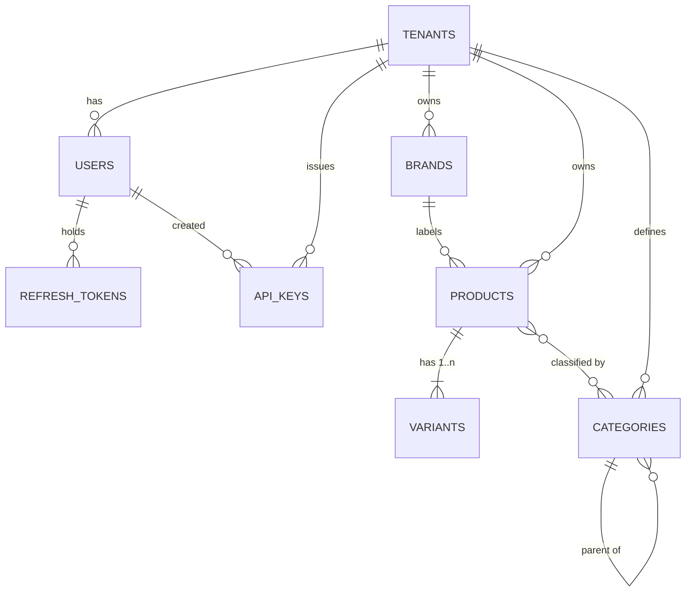

# Phase 1 — Catalog & Foundation · Data Model

**9 tables.** No prior schema — this phase creates the database.

---

## 1. Entity relationships



`product_categories` is the join table behind the many-to-many, and is what allows one product
to sit in several trees of different `kind` at once.

---

## 2. Conventions

Applied to every table in every phase.

- **Keys** are UUID v7, generated application-side. Time-ordered UUIDs keep B-tree inserts
  append-only, which random v4 does not. Never expose a sequential integer id in an API.
- **Money** is `bigint` in minor units plus `char(3)` currency. `2000000` + `IDR` is Rp 20.000.
  Never a float. IDR has no minor unit in practice, but keep the scale of 2 uniform so
  multi-currency is not a migration.
- **Timestamps** are `timestamptz`, always UTC. `tenants.timezone` is applied at render time.
- **Soft delete** via `archived_at timestamptz` only where an audit trail requires it.
- **Optimistic concurrency** via `version integer NOT NULL DEFAULT 1`, checked in the
  `UPDATE … WHERE version = $n` predicate and surfaced as the `If-Match` header.
- **Every tenant table** gets `ENABLE` + `FORCE ROW LEVEL SECURITY` and a `tenant_isolation`
  policy. Shown once below; assume it on all of them.

---

## 3. DDL

### 3.1 Extensions and shared helpers

```sql
CREATE EXTENSION IF NOT EXISTS ltree;
CREATE EXTENSION IF NOT EXISTS unaccent;
CREATE EXTENSION IF NOT EXISTS pg_trgm;

-- Applied to every tenant-owned table. Shown once, assume everywhere.
-- CREATE POLICY tenant_isolation ON <table>
--     USING      (tenant_id = current_setting('app.tenant_id', true)::uuid)
--     WITH CHECK (tenant_id = current_setting('app.tenant_id', true)::uuid);
```

### 3.2 Platform

```sql
CREATE TABLE tenants (
    id         uuid PRIMARY KEY,
    name       text NOT NULL,
    slug       text NOT NULL UNIQUE,
    timezone   text NOT NULL DEFAULT 'Asia/Jakarta',
    currency   char(3) NOT NULL DEFAULT 'IDR',
    status     text NOT NULL DEFAULT 'active'
               CHECK (status IN ('active','suspended','closed')),
    created_at timestamptz NOT NULL DEFAULT now()
);
-- No RLS on tenants itself; it is reached only through the auth path.

CREATE TABLE users (
    id            uuid PRIMARY KEY,
    tenant_id     uuid NOT NULL REFERENCES tenants(id),
    email         citext NOT NULL,
    password_hash text,                 -- null while an invitation is outstanding
    name          text NOT NULL,
    role          text NOT NULL DEFAULT 'viewer'
                  CHECK (role IN ('owner','admin','ops','warehouse','viewer')),
    status        text NOT NULL DEFAULT 'invited'
                  CHECK (status IN ('invited','active','disabled')),
    last_login_at timestamptz,
    created_at    timestamptz NOT NULL DEFAULT now(),
    UNIQUE (tenant_id, email)
);
ALTER TABLE tenants ADD CONSTRAINT tenants_id_uq UNIQUE (id);

CREATE TABLE refresh_tokens (
    id         uuid PRIMARY KEY,
    tenant_id  uuid NOT NULL REFERENCES tenants(id),
    user_id    uuid NOT NULL REFERENCES users(id) ON DELETE CASCADE,
    token_hash text NOT NULL,           -- SHA-256; the plaintext lives only in the cookie
    -- Rotation chain: a reused (already-rotated) token means theft. Revoke the
    -- whole chain rather than just rejecting the one request.
    rotated_from uuid REFERENCES refresh_tokens(id),
    expires_at timestamptz NOT NULL,
    revoked_at timestamptz,
    created_at timestamptz NOT NULL DEFAULT now(),
    UNIQUE (token_hash)
);
CREATE INDEX ON refresh_tokens (user_id) WHERE revoked_at IS NULL;

CREATE TABLE api_keys (
    id          uuid PRIMARY KEY,
    tenant_id   uuid NOT NULL REFERENCES tenants(id),
    name        text NOT NULL,
    key_hash    text NOT NULL UNIQUE,   -- SHA-256; plaintext shown once at creation
    key_prefix  text NOT NULL,          -- first 8 chars, so a user can identify it in a list
    permissions text[] NOT NULL DEFAULT '{}',
    created_by  uuid REFERENCES users(id),
    last_used_at timestamptz,
    revoked_at  timestamptz,
    created_at  timestamptz NOT NULL DEFAULT now()
);
```

### 3.3 Catalog

```sql
CREATE TABLE brands (
    id         uuid PRIMARY KEY,
    tenant_id  uuid NOT NULL REFERENCES tenants(id),
    name       text NOT NULL,
    slug       text NOT NULL,
    -- Marketplaces keep their own brand registries and reject a listing whose
    -- brand id is unknown to them. Mapping lives here so it is set once per
    -- brand rather than repeated on every product. Consumed by the Phase 1 CSV
    -- export and, from Phase 3, by the listing publisher.
    --   {"shopee": "12345", "tokopedia": "998", "tiktok": "abc"}
    channel_brand_ids jsonb NOT NULL DEFAULT '{}'::jsonb,
    archived_at timestamptz,
    created_at timestamptz NOT NULL DEFAULT now(),
    UNIQUE (tenant_id, slug)
);
CREATE INDEX ON brands (tenant_id) WHERE archived_at IS NULL;
ALTER TABLE brands ADD CONSTRAINT brands_id_tenant_uq UNIQUE (id, tenant_id);

CREATE TABLE categories (
    id         uuid PRIMARY KEY,
    tenant_id  uuid NOT NULL REFERENCES tenants(id),
    parent_id  uuid REFERENCES categories(id),
    -- Independent trees. One product may belong to one of each kind at once.
    kind       text NOT NULL DEFAULT 'category'
               CHECK (kind IN ('category','series','collection','activity','custom')),
    name       text NOT NULL,
    path       ltree NOT NULL,          -- derived by trigger, never client-supplied
    archived_at timestamptz,
    created_at timestamptz NOT NULL DEFAULT now(),
    UNIQUE (tenant_id, kind, path)
);
CREATE INDEX ON categories USING gist (path);
CREATE INDEX ON categories (tenant_id, kind, parent_id);
ALTER TABLE categories ADD CONSTRAINT categories_id_tenant_uq UNIQUE (id, tenant_id);

CREATE TABLE products (
    id           uuid PRIMARY KEY,
    tenant_id    uuid NOT NULL REFERENCES tenants(id),
    title        text NOT NULL,
    description  text,
    brand_id     uuid REFERENCES brands(id),   -- nullable: not every product has a brand
    status       text NOT NULL DEFAULT 'draft'
                 CHECK (status IN ('draft','active','archived')),
    -- Attributes that vary by category and by marketplace, where a column per
    -- field would be a migration every time a channel changes its requirements.
    --   {"material":"Cotton Combed 30s",
    --    "channel":{"shopee":{"category_id":"100017"}}}
    -- Never put anything you filter, sort or enforce uniqueness on in here.
    attributes   jsonb NOT NULL DEFAULT '{}'::jsonb,
    -- Ordered option axes, e.g. ['Colour','Size']. variants.option_values is
    -- positional against THIS array — the pairing is what makes the matrix
    -- editor a pivot rather than a join.
    option_names text[] NOT NULL DEFAULT '{}',
    version      integer NOT NULL DEFAULT 1,
    archived_at  timestamptz,
    created_at   timestamptz NOT NULL DEFAULT now(),
    updated_at   timestamptz NOT NULL DEFAULT now()
);
CREATE INDEX ON products (tenant_id, status) WHERE archived_at IS NULL;
CREATE INDEX ON products (tenant_id, brand_id) WHERE archived_at IS NULL;
CREATE INDEX ON products USING gin (attributes jsonb_path_ops);
CREATE INDEX ON products USING gin (title gin_trgm_ops);   -- the search box
ALTER TABLE products ADD CONSTRAINT products_id_tenant_uq UNIQUE (id, tenant_id);
ALTER TABLE products ADD CONSTRAINT products_same_tenant_as_brand
    FOREIGN KEY (brand_id, tenant_id) REFERENCES brands (id, tenant_id);

CREATE TABLE variants (
    id            uuid PRIMARY KEY,
    tenant_id     uuid NOT NULL REFERENCES tenants(id),
    product_id    uuid NOT NULL REFERENCES products(id) ON DELETE CASCADE,
    sku           text,          -- nullable: a draft variant may not have one yet
    barcode       text,
    -- Positional against products.option_names: ['Black','S']
    option_values text[] NOT NULL DEFAULT '{}',
    price_amount  bigint NOT NULL DEFAULT 0 CHECK (price_amount >= 0),
    compare_at_amount bigint CHECK (compare_at_amount IS NULL OR compare_at_amount >= 0),
    currency      char(3) NOT NULL DEFAULT 'IDR',
    weight_grams  integer NOT NULL DEFAULT 0 CHECK (weight_grams >= 0),
    -- NOTE: no quantity column, in any phase. Stock is never a property of a
    -- variant — it is a property of (variant, location) and lives in the
    -- ledger from Phase 4. buffer_qty ALTERs in at Phase 4 as well.
    archived_at   timestamptz,
    version       integer NOT NULL DEFAULT 1,
    created_at    timestamptz NOT NULL DEFAULT now(),
    updated_at    timestamptz NOT NULL DEFAULT now()
);
-- Partial unique index rather than a UNIQUE constraint: SKU is optional, so
-- many variants may sit with sku IS NULL while non-null ones stay unique.
CREATE UNIQUE INDEX variants_tenant_sku_uq
    ON variants (tenant_id, sku) WHERE sku IS NOT NULL;
CREATE INDEX ON variants (tenant_id, product_id);
ALTER TABLE variants ADD CONSTRAINT variants_id_tenant_uq UNIQUE (id, tenant_id);
ALTER TABLE variants ADD CONSTRAINT variants_same_tenant_as_product
    FOREIGN KEY (product_id, tenant_id) REFERENCES products (id, tenant_id);

CREATE TABLE product_categories (
    tenant_id   uuid NOT NULL,
    product_id  uuid NOT NULL REFERENCES products(id) ON DELETE CASCADE,
    category_id uuid NOT NULL REFERENCES categories(id) ON DELETE CASCADE,
    PRIMARY KEY (product_id, category_id)
);
CREATE INDEX ON product_categories (tenant_id, category_id);

CREATE TABLE product_media (
    id         uuid PRIMARY KEY,
    tenant_id  uuid NOT NULL REFERENCES tenants(id),
    product_id uuid NOT NULL REFERENCES products(id) ON DELETE CASCADE,
    variant_id uuid REFERENCES variants(id) ON DELETE SET NULL,  -- null = product-level
    r2_key     text NOT NULL,      -- an object key, never a URL: URLs expire, keys do not
    mime_type  text NOT NULL,
    bytes      bigint NOT NULL,
    width      integer,
    height     integer,
    position   integer NOT NULL DEFAULT 0,
    derivatives jsonb NOT NULL DEFAULT '{}'::jsonb,  -- {"800":"…/x_800.webp"}
    created_at timestamptz NOT NULL DEFAULT now()
);
CREATE INDEX ON product_media (tenant_id, product_id, position);
```

`product_media` is the tenth table and was not in the phase list, but imagery has nowhere else
to live and Phase 1 is the only sensible place for it.

### 3.4 Category path trigger

`path` is derived, never accepted from a client. A rename or a move rewrites the subtree
atomically, so no application code path can produce an inconsistent tree.

```sql
-- ltree labels accept only [A-Za-z0-9_], so names are slugified.
CREATE OR REPLACE FUNCTION slugify_label(txt text) RETURNS text AS $$
  SELECT regexp_replace(
           regexp_replace(lower(unaccent(coalesce(txt,''))), '[^a-z0-9]+', '_', 'g'),
           '^_+|_+$', '', 'g');
$$ LANGUAGE sql IMMUTABLE;

-- BEFORE: compute this row's own path.
CREATE OR REPLACE FUNCTION categories_set_path() RETURNS trigger AS $$
DECLARE
  parent_path ltree;
  base text; label text; candidate ltree; n int := 0;
BEGIN
  base := slugify_label(NEW.name);
  IF base = '' THEN base := 'cat'; END IF;

  IF NEW.parent_id IS NOT NULL THEN
    SELECT path INTO STRICT parent_path FROM categories WHERE id = NEW.parent_id;
    -- A category cannot be moved beneath its own descendant.
    IF TG_OP = 'UPDATE' AND parent_path <@ OLD.path THEN
      RAISE EXCEPTION 'cannot move category % beneath its own descendant', NEW.id;
    END IF;
  END IF;

  -- Two siblings named "Jackets" slugify identically; disambiguate.
  label := base;
  LOOP
    candidate := CASE WHEN parent_path IS NULL
                      THEN label::ltree ELSE parent_path || label::ltree END;
    EXIT WHEN NOT EXISTS (
      SELECT 1 FROM categories
       WHERE tenant_id = NEW.tenant_id AND kind = NEW.kind
         AND path = candidate AND id IS DISTINCT FROM NEW.id);
    n := n + 1;
    label := base || '_' || n;
  END LOOP;

  NEW.path := candidate;
  RETURN NEW;
END $$ LANGUAGE plpgsql;

CREATE TRIGGER categories_path_biu
  BEFORE INSERT OR UPDATE OF name, parent_id ON categories
  FOR EACH ROW EXECUTE FUNCTION categories_set_path();

-- AFTER: rebase every descendant when this row's path changed.
CREATE OR REPLACE FUNCTION categories_move_subtree() RETURNS trigger AS $$
BEGIN
  -- The UPDATE below re-fires this trigger on each descendant, which the single
  -- statement has already rebased. Stop at depth 1.
  IF pg_trigger_depth() > 1 THEN RETURN NULL; END IF;

  IF NEW.path IS DISTINCT FROM OLD.path THEN
    UPDATE categories
       SET path = NEW.path || subpath(path, nlevel(OLD.path))
     WHERE tenant_id = NEW.tenant_id
       AND path <@ OLD.path
       AND id <> NEW.id;
  END IF;
  RETURN NULL;
END $$ LANGUAGE plpgsql;

CREATE TRIGGER categories_move_aiu
  AFTER UPDATE OF path ON categories
  FOR EACH ROW EXECUTE FUNCTION categories_move_subtree();
```

---

## 4. Consequences to decide deliberately

### 4.1 A nullable SKU

Three flows key on SKU, all of them in later phases: `POST /products/bulk` upserts by it
(Phase 2), `POST /products/import` matches rows by it (Phase 2), and marketplace listing
autodiscovery matches items by it (Phase 3). A variant with `sku IS NULL` therefore cannot be
upserted, imported into, or auto-mapped — it can only be created and then edited by id.

That is the right trade for a draft a merchandiser is still building, and the wrong state for
anything published. **Enforce SKU at the point of publication, not at insertion:** a product
cannot leave `status = 'draft'` while any of its variants lack a SKU, and (from Phase 3) a
null-SKU variant cannot be attached to a channel listing. Keep the check in the publish path,
not as a table constraint, so drafting stays frictionless.

### 4.2 No quantity column, ever

There is no `qty` on `variants` and there never will be. Quantity is a property of
*(variant, location)*, and even then it is derived from an append-only ledger rather than
stored as truth — see `phase-4/Data model - ERD.md`.

Putting `qty` here would cost four things at once: multi-warehouse becomes impossible, the
audit trail disappears ("why is stock 40?" is unanswerable), every order for any variant of a
product contends on the same row, and *on hand* becomes indistinguishable from *reserved* —
which is exactly the distinction that prevents oversell.

In Phases 1–3 stock is simply unlimited. That is a scope decision, not a data model decision,
and the data model does not need to change to accommodate it.

---

## 5. What later phases add to these tables

Nothing in Phase 1 is dropped or renamed later. The additions:

| Phase | Change to a Phase 1 table |
|---|---|
| 2 | None. Phase 2 is purely additive |
| 3 | None. `channel_listings` references `variants` from the new side |
| 4 | `ALTER TABLE variants ADD COLUMN buffer_qty integer NOT NULL DEFAULT 0` |

That Phase 1 survives three phases without a destructive migration is the point of spending
time on it now.
